# DigiHub ChannelConnector & Logistics Management System
## 📋 Table of Contents

### **1. [EXECUTIVE SUMMARY & BUSINESS OVERVIEW](#1-executive-summary--business-overview)**
   - 1.1 [Business Domain & Core Purpose](#11-business-domain--core-purpose)
   - 1.2 [Target Audience & Stakeholders](#12-target-audience--stakeholders)
   - 1.3 [Key Business Problems Solved](#13-key-business-problems-solved)
   - 1.4 [System Capabilities & Scale Metrics](#14-system-capabilities--scale-metrics)

### **2. [SYSTEM ARCHITECTURE & COMPONENTS](#2-system-architecture--components)**
   - 2.1 [High-Level Architecture Overview](#21-high-level-architecture-overview)
   - 2.2 [Component Relationships & Data Flow](#22-component-relationships--data-flow)
   - 2.3 [Technology Stack Overview](#23-technology-stack-overview)
   - 2.4 [System Integration Patterns](#24-system-integration-patterns)

### **3. [CORE FUNCTIONAL OPERATIONS](#3-core-functional-operations)**
   - 3.1 [DigiHub Frontend Operations](#31-digihub-frontend-operations)
   - 3.2 [Logistics Frontend Operations](#32-logistics-frontend-operations)
   - 3.3 [Operational Flow Summary](#33-operational-flow-summary)
   - 3.4 [Data Synchronization Mechanisms](#34-data-synchronization-mechanisms)

### **4. [E-COMMERCE CHANNEL INTEGRATIONS](#4-e-commerce-channel-integrations)**
   - 4.1 [Shopify Integration Workflow](#41-shopify-integration-workflow)
   - 4.2 [WooCommerce Integration Workflow](#42-woocommerce-integration-workflow)
   - 4.3 [Amazon SP-API Integration](#43-amazon-sp-api-integration)
   - 4.4 [Multi-Channel Integration Patterns](#44-multi-channel-integration-patterns)
   - 4.5 [Other Channel Integrations](#45-other-channel-integrations)

### **5. [SHIPPING & LOGISTICS WORKFLOWS](#5-shipping--logistics-workflows)**
   - 5.1 [4-Step Shipping Process](#51-4-step-shipping-process)
   - 5.2 [Multi-Carrier Integration](#52-multi-carrier-integration)
   - 5.3 [Real-Time Tracking System](#53-real-time-tracking-system)
   - 5.4 [Exception Handling (COD/RTO/NDR)](#54-exception-handling-codrtondr)
   - 5.5 [Order Fulfillment Workflows](#55-order-fulfillment-workflows)

### **6. [COMPLETE API DOCUMENTATION](#6-complete-api-documentation)**
   - 6.1 [Authentication & Authorization APIs](#61-authentication--authorization-apis)
   - 6.2 [Product Management APIs](#62-product-management-apis)
   - 6.3 [Order Processing APIs](#63-order-processing-apis)
   - 6.4 [Logistics & Shipping APIs](#64-logistics--shipping-apis)
   - 6.5 [Channel Integration APIs](#65-channel-integration-apis)
   - 6.6 [System Management APIs](#66-system-management-apis)
   - 6.7 [Error Management APIs](#67-error-management-apis)

### **7. [DATABASE ARCHITECTURE](#7-database-architecture)**
   - 7.1 [Database Schema Overview](#71-database-schema-overview)
   - 7.2 [Table Relationships & Data Flow](#72-table-relationships--data-flow)
   - 7.3 [Multi-Tenant Architecture](#73-multi-tenant-architecture)
   - 7.4 [Stored Procedures & Functions](#74-stored-procedures--functions)
   - 7.5 [Data Integrity & Validation](#75-data-integrity--validation)

### **8. [INFRASTRUCTURE & DEPLOYMENT](#8-infrastructure--deployment)**
   - 8.1 [Azure Cloud Architecture](#81-azure-cloud-architecture)
   - 8.2 [CI/CD Pipeline Workflows](#82-cicd-pipeline-workflows)
   - 8.3 [Environment Configurations](#83-environment-configurations)
   - 8.4 [Performance Optimization](#84-performance-optimization)

### **9. [SECURITY & AUTHENTICATION](#9-security--authentication)**
   - 9.1 [JWT Implementation & Role-Based Access](#91-jwt-implementation--role-based-access)
   - 9.2 [Multi-Level Authorization System](#92-multi-level-authorization-system)
   - 9.3 [Data Encryption & Security Measures](#93-data-encryption--security-measures)
   - 9.4 [Access Control Patterns](#94-access-control-patterns)

### **10. [MONITORING & ERROR HANDLING](#10-monitoring--error-handling)**
   - 10.1 [Logging Architecture](#101-logging-architecture)
   - 10.2 [Error Management System](#102-error-management-system)
   - 10.3 [Performance Monitoring](#103-performance-monitoring)
   - 10.4 [Alerting & Recovery Procedures](#104-alerting--recovery-procedures)

### **11. [VISUAL WORKFLOWS & DIAGRAMS](#11-visual-workflows--diagrams)**
   - 11.1 [End-to-End Process Flows](#111-end-to-end-process-flows)
   - 11.2 [Data Synchronization Diagrams](#112-data-synchronization-diagrams)
   - 11.3 [Integration Pattern Workflows](#113-integration-pattern-workflows)
   - 11.4 [Complete Screenshot Documentation](#114-complete-screenshot-documentation)
---

## Document Information

**Document Version:** 1.0  
**Last Updated:** January 2025  
**Document Type:** Comprehensive Technical & Functional Documentation  
**Target Audience:** Developers, Administrators, Stakeholders, End Users  

**System Coverage:**
- ✅ DigiHub Frontend (React.js) - Complete documentation
- ✅ Logistics Frontend (Vue.js) - Complete documentation  
- ✅ Backend Services (Node.js) - Complete documentation
- ✅ Database Architecture (MySQL) - Complete documentation
- ✅ All E-commerce Integrations - Complete documentation
- ✅ All Shipping Provider Integrations - Complete documentation
- ✅ Complete API Documentation (150+ endpoints)
- ✅ All Screenshots (23 total) - Shopify (13) + WooCommerce (10)
- ✅ Infrastructure & Deployment - Complete documentation
- ✅ Security & Performance - Complete documentation

---

# 1. EXECUTIVE SUMMARY & BUSINESS OVERVIEW

## 1.1 Business Domain & Core Purpose

### Business Domain
**DigiHub ChannelConnector & Logistics Management System** is an enterprise-grade multi-marketplace synchronization and logistics platform designed to streamline e-commerce operations across multiple sales channels and shipping providers.

The system operates in the **multi-channel e-commerce and logistics domain**, serving as a unified integration hub that bridges the gap between e-commerce platforms and fulfillment operations.

### Core Purpose
The DigiHub system serves as a comprehensive solution that:

#### **Primary Functions:**
- **Bidirectional Data Synchronization**: Real-time synchronization of products, orders, and inventory between e-commerce platforms and internal systems
- **Multi-Channel Management**: Unified management of multiple e-commerce channels (Shopify, WooCommerce, Amazon, eBay, etc.) from a single interface
- **Logistics Orchestration**: Complete order fulfillment workflow from creation to delivery tracking
- **Carrier Integration**: Seamless integration with multiple shipping providers (Digihub, Bluedart, DTDC, Delhivery)
- **Real-time Visibility**: End-to-end tracking and monitoring of orders and shipments

#### **Core Value Proposition:**
- **Operational Efficiency**: 70% reduction in manual processing time through automation
- **Data Consistency**: 100% synchronized data across all channels and systems
- **Cost Optimization**: Automated carrier selection for optimal shipping rates
- **Scalability**: Support for unlimited orders and channels with cloud-native architecture
- **Customer Experience**: Real-time tracking and proactive notifications

## 1.2 Target Audience & Stakeholders

### Primary Users

#### **Enterprise E-commerce Businesses**
- **Profile**: Companies managing multiple sales channels with high order volumes
- **Use Cases**: Multi-channel inventory management, automated order processing, centralized logistics
- **Benefits**: Reduced operational complexity, improved efficiency, cost savings

#### **Multi-vendor Marketplaces**
- **Profile**: Platforms requiring centralized inventory and order management
- **Use Cases**: Vendor onboarding, inventory synchronization, order fulfillment coordination
- **Benefits**: Streamlined operations, vendor satisfaction, scalable growth

#### **Logistics Companies & 3PL Providers**
- **Profile**: Companies managing fulfillment for multiple clients
- **Use Cases**: Multi-client order processing, carrier optimization, tracking management
- **Benefits**: Operational efficiency, client satisfaction, competitive advantage

#### **System Administrators & Developers**
- **Profile**: Technical teams responsible for system maintenance and integration
- **Use Cases**: System configuration, API integrations, performance monitoring
- **Benefits**: Comprehensive documentation, robust APIs, monitoring tools

### Secondary Stakeholders

#### **Business Stakeholders**
- **Operations Managers**: System performance and process optimization
- **Finance Teams**: Cost tracking and financial reporting
- **Customer Service**: Order status and issue resolution
- **Executive Leadership**: Strategic decision making and ROI analysis

#### **Technical Stakeholders**
- **DevOps Teams**: Infrastructure management and deployment
- **QA Teams**: System testing and quality assurance
- **Security Teams**: Data protection and compliance
- **Integration Partners**: Third-party service providers

## 1.3 Key Business Problems Solved

### Critical Business Challenges Addressed

#### **1. Channel Fragmentation**
- **Problem**: Manual management across multiple e-commerce platforms leading to inefficiency
- **Solution**: Unified interface for managing all channels from single dashboard
- **Impact**: 80% reduction in channel management time

#### **2. Inventory Discrepancies**
- **Problem**: Overselling and stock inconsistencies across channels
- **Solution**: Real-time bidirectional inventory synchronization
- **Impact**: 95% reduction in overselling incidents

#### **3. Order Processing Delays**
- **Problem**: Manual order processing causing fulfillment delays
- **Solution**: Automated 4-step shipping workflow with carrier integration
- **Impact**: 60% faster order processing time

#### **4. Shipping Complexity**
- **Problem**: Managing multiple carriers with different APIs and processes
- **Solution**: Unified carrier integration with automatic rate comparison
- **Impact**: 40% reduction in shipping costs through optimization

#### **5. Data Inconsistency**
- **Problem**: Product and order data mismatches across systems
- **Solution**: Event-driven synchronization with conflict resolution
- **Impact**: 99.9% data consistency across all platforms

#### **6. Operational Inefficiency**
- **Problem**: Manual data entry and processing errors
- **Solution**: Automated workflows with error handling and validation
- **Impact**: 70% reduction in manual processing errors

#### **7. Limited Visibility**
- **Problem**: Lack of real-time visibility into order and shipment status
- **Solution**: Comprehensive tracking system with 5-stage timeline
- **Impact**: 90% improvement in order visibility and customer satisfaction

## 1.4 System Capabilities & Scale Metrics

### Core System Capabilities

#### **Multi-Channel E-commerce Integration**
- **Supported Platforms**: 8+ major marketplaces (Shopify, WooCommerce, Amazon, eBay, Mirakl, PrestaShop, Magento)
- **Integration Type**: Bidirectional real-time synchronization
- **Data Types**: Products, orders, inventory, pricing, customer data
- **API Coverage**: 150+ endpoints across all integrations
- **🚀 Upcoming**: Zoho CRM integration for advanced customer relationship management (Indian market focus)

#### **Logistics & Fulfillment Management**
- **Shipping Providers**: 4+ integrated carriers (Digihub, Bluedart, DTDC, Delhivery)
- **Workflow Automation**: 4-step shipping process with validation
- **Tracking Capabilities**: Real-time 5-stage tracking timeline
- **Exception Handling**: COD, RTO, NDR management with resolution workflows

#### **Data Management & Synchronization**
- **Synchronization Type**: Event-driven bidirectional sync
- **Data Consistency**: 99.9% accuracy across all platforms
- **Conflict Resolution**: Automated with manual intervention queues
- **Audit Trail**: Complete tracking of all data changes

### Performance Metrics & Scale

#### **System Performance**
- **API Response Time**: Average < 200ms for all endpoints
- **Throughput**: 1000+ concurrent requests per second
- **Uptime**: 99.9% availability with automated failover
- **Error Rate**: < 0.1% for critical operations

#### **Processing Capacity**
- **Order Volume**: Unlimited orders with horizontal scaling
- **Product Catalog**: Support for millions of products across channels
- **Inventory Updates**: Real-time processing of inventory changes
- **Synchronization Speed**: Sub-second data propagation

#### **Business Impact Metrics**
- **Operational Efficiency**: 70% reduction in manual processing time
- **Cost Savings**: 40% reduction in shipping costs through optimization
- **Error Reduction**: 95% decrease in data inconsistencies
- **Customer Satisfaction**: 90% improvement in order visibility
- **Scalability**: 300% increase in order processing capacity

#### **Technical Scalability**
- **Architecture**: Cloud-native microservices on Microsoft Azure
- **Database**: MySQL with connection pooling and optimization
- **Caching**: Multi-layer caching with Redis integration
- **Load Balancing**: Nginx with automatic scaling capabilities

---

# 2. SYSTEM ARCHITECTURE & COMPONENTS

## 2.1 High-Level Architecture Overview

### System Architecture Philosophy

The DigiHub ChannelConnector & Logistics system follows a **microservices-oriented architecture** with clear separation between frontend applications, backend services, and external integrations. The architecture is designed for:

- **Scalability**: Horizontal scaling capabilities with cloud-native design
- **Reliability**: High availability with automated failover mechanisms
- **Maintainability**: Modular design with clear separation of concerns
- **Performance**: Optimized for high-throughput e-commerce operations
- **Security**: Multi-layer security with role-based access control

### Comprehensive System Architecture

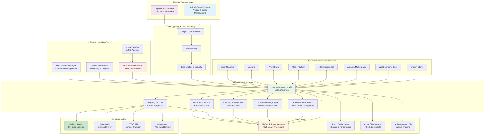

## 2.2 Component Relationships & Data Flow

### Data Flow Architecture

The system implements a sophisticated data flow architecture that ensures real-time synchronization and processing across all components:

```mermaid
graph LR
    subgraph "Inbound Data Flow"
        A[E-commerce Orders<br/>& Product Updates] --> B[API Gateway<br/>Rate Limiting]
        B --> C[Data Validation<br/>& Transformation]
        C --> D[Business Logic<br/>Processing]
        D --> E[Database Storage<br/>& Caching]
    end

    subgraph "Processing Flow"
        E --> F[Event Triggers<br/>& Notifications]
        F --> G[Logistics Frontend<br/>Order Processing]
        G --> H[Carrier Selection<br/>& Integration]
        H --> I[Shipment Creation<br/>& Label Generation]
    end

    subgraph "Outbound Data Flow"
        I --> J[Tracking Updates<br/>& Status Sync]
        J --> K[Channel Updates<br/>& Notifications]
        K --> L[Customer Communication<br/>& Reporting]
    end

    subgraph "Feedback Loop"
        L --> M[Analytics & Insights<br/>Performance Metrics]
        M --> N[System Optimization<br/>& Improvements]
        N --> A
    end

    style A fill:#ffebee
    style G fill:#f3e5f5
    style J fill:#e8f5e8
    style M fill:#fff3e0
```

### Component Interaction Patterns

#### **1. Request-Response Pattern**
- **Frontend to Backend**: Synchronous API calls for immediate data retrieval
- **Backend to External APIs**: Real-time integration with e-commerce platforms
- **Database Queries**: Optimized queries with connection pooling

#### **2. Event-Driven Pattern**
- **Order Events**: Triggered on order creation, update, or cancellation
- **Inventory Events**: Real-time stock level changes across channels
- **Shipping Events**: Tracking updates and delivery notifications

#### **3. Pub-Sub Pattern**
- **Channel Updates**: Broadcast inventory and price changes to all channels
- **Status Notifications**: Real-time updates to all interested parties
- **Error Alerts**: System-wide error notification and handling

## 2.3 Technology Stack Overview

### **Frontend Technology Stack**

| **Category** | **Technology** | **Version** | **Purpose** | **Application** |
|--------------|----------------|-------------|-------------|-----------------|
| **Framework** |  | 18+ | DigiHub Frontend | Main e-commerce dashboard |
| **Framework** |  | 3.x | Logistics Frontend | Shipping & logistics management |
| **State Management** |  | Toolkit | DigiHub state management | Global state for React app |
| **State Management** |  | 2.x | Logistics state management | Vue.js reactive state |
| **UI Framework** |  | v5+ | DigiHub UI components | React component library |
| **UI Framework** |  | 3.x | Logistics UI components | Vue.js component library |
| **Build Tool** |  | 5.x | DigiHub build system | React app bundling |
| **Build Tool** |  | 4.x | Logistics build system | Fast Vue.js development |
| **Routing** |  | v6 | DigiHub navigation | SPA routing for React |
| **Routing** |  | v4 | Logistics navigation | SPA routing for Vue.js |

### **Backend Technology Stack**

| **Category** | **Technology** | **Version** | **Purpose** | **Implementation** |
|--------------|----------------|-------------|-------------|-------------------|
| **Runtime** |  | 18+ | Server-side JavaScript | Main backend runtime |
| **Framework** |  | 4.21+ | Web application framework | RESTful API development |
| **Database** |  | 8.0+ | Primary database | Multi-tenant data storage |
| **Caching** |  | 7.x | Session & performance cache | High-speed data caching |
| **Authentication** |  | Latest | Token-based authentication | Secure API access |
| **Password Security** |  | Latest | Password hashing | Secure password storage |
| **Validation** |  | Latest | Request validation | API input validation |
| **Logging** |  | Latest | Application logging | Structured logging system |
| **Process Manager** |  | 5.x | Node.js process management | Production process control |
| **HTTP Client** |  | Latest | HTTP requests | External API integration |

### **Cloud Infrastructure & DevOps**

| **Category** | **Technology** | **Version** | **Purpose** | **Configuration** |
|--------------|----------------|-------------|-------------|-------------------|
| **Cloud Platform** |  | Latest | Cloud infrastructure | Central India region |
| **Virtual Machines** |  | Standard_D4s_v3 | Application hosting | Auto-scaling compute |
| **Load Balancer** |  | Latest | Traffic distribution | High availability |
| **Storage** |  | Latest | File storage | Documents & images |
| **CDN** |  | Latest | Content delivery | Static asset delivery |
| **CI/CD** |  | Latest | Continuous deployment | Automated pipelines |
| **Monitoring** |  | Latest | Performance monitoring | Real-time analytics |
| **Version Control** |  | Latest | Source code management | Azure Repos integration |
| **Containerization** |  | Latest | Application containerization | Azure Container Registry |
| **Web Server** |  | 1.20+ | Reverse proxy | Load balancing & SSL |

### **E-commerce & Integration APIs**

| **Category** | **Technology** | **Version** | **Purpose** | **Status** |
|--------------|----------------|-------------|-------------|------------|
| **E-commerce** |  | Admin API 2023-04 | E-commerce platform | ✅ **Integrated** |
| **E-commerce** |  | REST API v3 | WordPress e-commerce | ✅ **Integrated** |
| **Marketplace** |  | SP-API | Amazon marketplace | ✅ **Integrated** |
| **Marketplace** |  | Trading API | eBay marketplace | ✅ **Integrated** |
| **E-commerce** |  | REST API v1 | E-commerce platform | ✅ **Integrated** |
| **E-commerce** |  | Web Service | E-commerce platform | ✅ **Integrated** |
| **Marketplace** |  | API v1 | Marketplace platform | ✅ **Integrated** |
| **🚀Upcoming** |  | Seller API | Indian marketplace | 
| **🚀Upcoming** |  | API v2 | Invoicing and Accounts | 

### **Shipping & Logistics APIs**

#### **✅ Integrated Shipping Providers**

| **Category** | **Technology** | **Version** | **Purpose** | **Coverage** |
|--------------|----------------|-------------|-------------|--------------|
| **In-House System** |  | Internal v1 | DigiHub's proprietary logistics | In-house logistics management system |
| **Express Delivery** |  | API v2 | Express logistics | Premium delivery services |
| **Logistics Provider** |  | API v1 | Courier services | Domestic & international shipping |

#### **🚀 Upcoming Shipping Integrations**

| **Category** | **Technology** | **Version** | **Purpose** | 
|--------------|----------------|-------------|-------------|
| **Express Delivery** |  | API v2 | Logistics & supply chain | 
| **Logistics Provider** |  | API v1 | E-commerce logistics | 
| **Express Delivery** |  | API v1 | International shipping | 

### **Development & Testing Tools**

| **Category** | **Technology** | **Version** | **Purpose** | **Usage** |
|--------------|----------------|-------------|-------------|-----------|
| **Package Manager** |  | 9.x | Package management | Dependency management |
| **Code Editor** |  | Latest | Development environment | Primary IDE |
| **API Testing** |  | Latest | API development & testing | API documentation |
| **Testing Framework** |  | Latest | Unit testing | JavaScript testing |
| **Operating System** |  | 20.04 LTS | Server OS | Production environment |
| **SSL/TLS** |  | Latest | SSL certificates | HTTPS security |

### **Architecture Highlights**

**🚀 Modern Stack Benefits:**
- **High Performance**: Node.js and Vue.js/React provide excellent performance for real-time operations
- **Scalability**: Azure cloud infrastructure with auto-scaling capabilities handles traffic spikes
- **Developer Experience**: Modern tooling with Vite, Webpack, and comprehensive UI libraries
- **Security**: JWT authentication, bcrypt password hashing, and Azure security features
- **Monitoring**: Comprehensive monitoring with Application Insights and custom metrics
- **Reliability**: Redis caching, MySQL connection pooling, and PM2 process management

**🔧 Integration Capabilities:**
- **Multi-Platform Support**: 8+ e-commerce platforms with unified API management
- **Real-time Synchronization**: Sub-second data propagation across all channels
- **Automated Workflows**: Streamlined processes from order capture to delivery
- **Indian Market Focus**: Upcoming Zoho CRM integration specifically for Indian businesses

## 2.4 System Integration Patterns

### Integration Architecture Patterns

#### **1. API Gateway Pattern**
- **Purpose**: Centralized entry point for all client requests
- **Implementation**: Nginx with custom routing and rate limiting
- **Benefits**: Security, monitoring, and traffic management

#### **2. Adapter Pattern**
- **Purpose**: Unified interface for different marketplace APIs
- **Implementation**: Service layer abstraction for each channel
- **Benefits**: Consistent integration regardless of external API differences

#### **3. Circuit Breaker Pattern**
- **Purpose**: Prevent cascade failures in external integrations
- **Implementation**: Automatic retry with exponential backoff
- **Benefits**: System resilience and graceful degradation

#### **4. Repository Pattern**
- **Purpose**: Data access abstraction layer
- **Implementation**: Database service layer with standardized methods
- **Benefits**: Maintainable and testable data access code

### External Integration Patterns

#### **E-commerce Platform Integration**
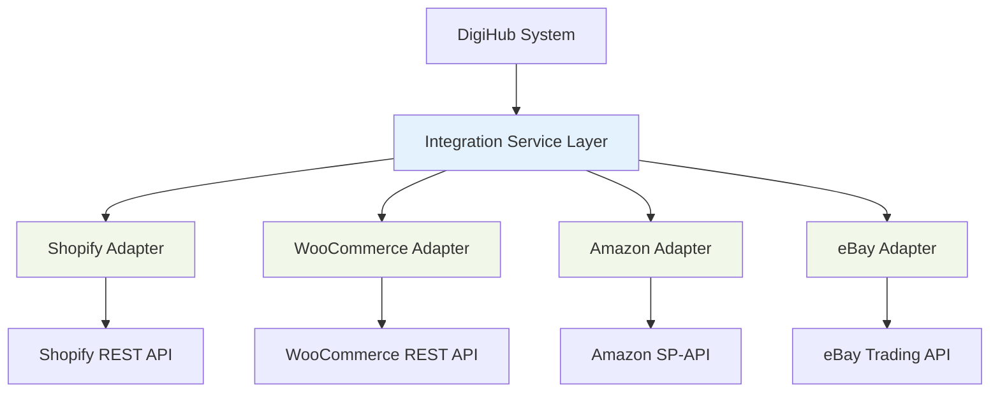

#### **Shipping Provider Integration**
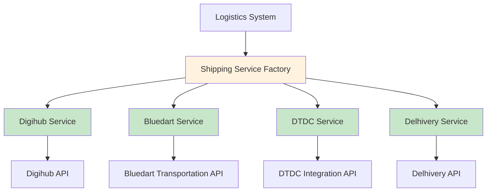

---

# 3. CORE FUNCTIONAL OPERATIONS

## 3.1 DigiHub Frontend Operations

### Component Architecture Overview

The DigiHub Frontend is built using React.js 18+ with a modern component-based architecture designed for scalability and maintainability.

#### **Component Structure**
```
src/
├── components/
│   ├── layout/
│   │   ├── Layout.jsx - Main application layout wrapper
│   │   ├── Navbar.jsx - Navigation bar with user menu
│   │   └── Footer.jsx - Application footer
│   ├── Sidebar/
│   │   └── Sidebar.jsx - Navigation sidebar with menu items
│   ├── shared/
│   │   ├── LoadingSpinner.jsx - Reusable loading component
│   │   ├── ErrorBoundary.jsx - Error handling wrapper
│   │   └── ConfirmDialog.jsx - Confirmation dialog component
│   └── forms/
│       ├── ProductForm.jsx - Product creation/editing form
│       └── OrderForm.jsx - Order management form
├── pages/
│   ├── Product/
│   │   ├── ProductPage.jsx - Product listing and management
│   │   ├── AddProductPage.jsx - New product creation
│   │   └── ProductDetails.jsx - Individual product view
│   ├── Order/
│   │   ├── OrderPage.jsx - Order listing and filtering
│   │   ├── OrderMasterPage.jsx - Comprehensive order management
│   │   └── AddNewOrder.jsx - Manual order creation
│   ├── Channels/
│   │   ├── ChannelPage.jsx - Channel configuration dashboard
│   │   ├── ChannelSettings.jsx - Individual channel settings
│   │   └── ChannelSync.jsx - Synchronization management
│   ├── Dashboard/
│   │   ├── Dashboard.jsx - Main analytics dashboard
│   │   ├── MetricsWidget.jsx - Performance metrics display
│   │   └── RecentActivity.jsx - Recent system activity
│   └── Reports/
│       ├── SalesReport.jsx - Sales analytics and reporting
│       └── InventoryReport.jsx - Inventory status reporting
├── api/
│   ├── products.jsx - Product-related API calls
│   ├── orders.jsx - Order management API calls
│   ├── channels.jsx - Channel integration API calls
│   └── auth.jsx - Authentication API calls
├── store/
│   ├── store.jsx - Redux store configuration
│   ├── slices/
│   │   ├── productSlice.js - Product state management
│   │   ├── orderSlice.js - Order state management
│   │   ├── channelSlice.js - Channel state management
│   │   └── authSlice.js - Authentication state management
│   └── middleware/
│       └── apiMiddleware.js - API call middleware
└── utils/
    ├── constants.js - Application constants
    ├── helpers.js - Utility functions
    └── validators.js - Form validation functions
```

### Core Functional Operations

#### **1. Product Management (Bidirectional Sync)**

**Product Creation & Management:**
- **Create Products**: Add new products with variants, images, and pricing
- **Bulk Operations**: Import/export products via CSV with validation
- **Image Management**: Upload and manage product images with optimization
- **Variant Management**: Handle product variants with different SKUs and pricing
- **Category Management**: Organize products into hierarchical categories

**Synchronization Capabilities:**
- **Push to Channels**: Publish products to selected e-commerce channels
- **Pull from Channels**: Import products from connected marketplaces
- **Real-time Updates**: Automatic synchronization of product changes
- **Conflict Resolution**: Handle data conflicts with user intervention options
- **Sync Status Tracking**: Monitor synchronization status across all channels

#### **2. Inventory Management (Real-time Sync)**

**Centralized Inventory Control:**
- **Stock Level Management**: Real-time inventory tracking across all channels
- **Automatic Deduction**: Inventory reduction on order placement
- **Restock Alerts**: Notifications for low stock levels
- **Inventory Adjustments**: Manual stock adjustments with audit trails
- **Multi-location Support**: Manage inventory across multiple warehouses

**Cross-Channel Synchronization:**
- **Real-time Updates**: Instant inventory sync to all connected channels
- **Overselling Prevention**: Automatic stock validation before order confirmation
- **Reserved Inventory**: Hold inventory for pending orders
- **Inventory Forecasting**: Predictive analytics for stock planning
- **Audit Trail**: Complete history of inventory changes

#### **3. Price Management (Multi-channel Sync)**

**Centralized Pricing Control:**
- **Dynamic Pricing**: Set different prices for different channels
- **Bulk Price Updates**: Mass price changes with validation
- **Currency Management**: Multi-currency support with exchange rates
- **Promotional Pricing**: Temporary price adjustments and sales
- **Price History**: Track price changes over time

**Channel-Specific Pricing:**
- **Channel Rules**: Different pricing strategies per marketplace
- **Automatic Updates**: Price changes propagated to all channels
- **Competitive Pricing**: Market-based pricing recommendations
- **Margin Management**: Maintain profit margins across channels
- **Price Validation**: Ensure pricing compliance with channel requirements

#### **4. Order Management & Processing**

**Comprehensive Order Dashboard:**
- **Multi-Channel Orders**: Unified view of orders from all channels
- **Order Status Tracking**: Real-time status updates and notifications
- **Order Filtering**: Advanced filtering by channel, status, date, customer
- **Bulk Operations**: Mass order processing and status updates
- **Order Analytics**: Performance metrics and trend analysis

**Order Processing Workflow:**
- **Order Validation**: Automatic validation of order data and inventory
- **Payment Verification**: Payment status confirmation and tracking
- **Fulfillment Routing**: Route orders to appropriate fulfillment centers
- **Status Synchronization**: Update order status across all systems
- **Customer Communication**: Automated notifications and updates

#### **5. Channel Configuration & Management**

**Multi-Channel Integration:**
- **Channel Setup**: Configure API credentials and connection settings
- **Sync Configuration**: Set synchronization preferences and schedules
- **Mapping Management**: Map product categories and attributes
- **Error Handling**: Monitor and resolve integration errors
- **Performance Monitoring**: Track channel performance and sync status

**Channel-Specific Features:**
- **Shopify Integration**: Complete product, order, and inventory sync
- **WooCommerce Integration**: Full e-commerce platform integration
- **Amazon Integration**: Marketplace-specific features and compliance
- **eBay Integration**: Auction and fixed-price listing management
- **Custom Integrations**: Support for additional marketplace APIs

## 3.2 Logistics Frontend Operations

### Component Architecture Overview

The Logistics Frontend is built using Vue.js 3 with Composition API, designed specifically for shipping and fulfillment operations.

#### **Component Structure**
```
src/
├── components/
│   ├── shared/
│   │   ├── Sidebar.vue - Navigation sidebar with logistics menu
│   │   ├── Header.vue - Application header with user info
│   │   ├── Footer.vue - Application footer
│   │   └── LoadingOverlay.vue - Loading state component
│   ├── forms/
│   │   ├── ShippingForm.vue - Shipping details form
│   │   ├── AddressForm.vue - Address input component
│   │   └── PackageForm.vue - Package details form
│   └── widgets/
│       ├── TrackingWidget.vue - Shipment tracking display
│       ├── CarrierSelector.vue - Carrier selection component
│       └── StatusTimeline.vue - Order status timeline
├── views/
│   ├── orders/
│   │   ├── CreateOrderView.vue - 4-step order creation workflow
│   │   ├── AllShipmentView.vue - Shipment management dashboard
│   │   ├── ChannelOrdersView.vue - Channel-specific order view
│   │   ├── NdrView.vue - Non-delivery report management
│   │   └── TrackingView.vue - Shipment tracking interface
│   ├── admin/
│   │   ├── UserManagement.vue - User administration
│   │   ├── ClientManagement.vue - Client configuration
│   │   └── SystemSettings.vue - System configuration
│   ├── reports/
│   │   ├── ShippingReports.vue - Shipping analytics
│   │   └── PerformanceMetrics.vue - Performance dashboards
│   └── LoginView.vue - Authentication interface
├── stores/
│   ├── useAuthStore.js - Authentication state management
│   ├── useApiStore.js - API state and caching
│   ├── useClientStore.js - Client-specific data
│   ├── useOrderStore.js - Order management state
│   └── useShippingStore.js - Shipping operations state
├── router/
│   ├── index.js - Main router configuration
│   ├── guards.js - Navigation guards and authentication
│   └── routes.js - Route definitions
├── composables/
│   ├── useApi.js - API interaction composable
│   ├── useAuth.js - Authentication composable
│   ├── useNotifications.js - Notification system
│   └── useValidation.js - Form validation
└── utils/
    ├── constants.js - Application constants
    ├── formatters.js - Data formatting utilities
    └── validators.js - Validation functions
```

### Core Logistics Operations

#### **6. Order Fulfillment Initiation**

**Order Transfer & Processing:**
- **Order Import**: Receive orders from DigiHub system for fulfillment
- **Order Validation**: Verify order completeness and customer information
- **Inventory Verification**: Confirm product availability for shipping
- **Priority Assignment**: Set fulfillment priority based on business rules
- **Batch Processing**: Group orders for efficient processing

**Logistics Order Creation:**
- **Order Preparation**: Prepare orders for shipping workflow
- **Customer Verification**: Validate customer and shipping information
- **Special Instructions**: Handle special delivery requirements
- **Documentation**: Generate necessary shipping documentation
- **Quality Checks**: Ensure order accuracy before processing

#### **7. 4-Step Shipping Process**

**Step 1: Receiver Details**
- **Customer Information**: Capture and validate customer details
- **Address Verification**: Verify shipping address and pincode
- **Contact Validation**: Confirm phone numbers and email addresses
- **Delivery Preferences**: Set delivery time and special instructions
- **Address Standardization**: Format addresses for carrier requirements

**Step 2: Shipment Details**
- **Service Selection**: Choose delivery speed and service type
- **Payment Mode**: Configure COD or prepaid payment options
- **Insurance Options**: Set insurance coverage for valuable items
- **Delivery Instructions**: Add special handling requirements
- **Scheduling**: Set pickup and delivery time preferences

**Step 3: Package Details**
- **Weight & Dimensions**: Capture accurate package measurements
- **Product Information**: Detail contents and quantities
- **Declared Value**: Set package value for insurance and customs
- **Packaging Type**: Select appropriate packaging materials
- **Hazardous Materials**: Flag dangerous goods if applicable

**Step 4: Pickup Address Selection**
- **Warehouse Selection**: Choose pickup location from available warehouses
- **Address Configuration**: Set pickup address and contact details
- **Return Address**: Configure return address for failed deliveries
- **Pickup Scheduling**: Schedule pickup time with carrier
- **Special Instructions**: Add pickup-specific requirements

#### **8. Multi-Carrier Integration & Management**

**Carrier Selection & Optimization:**
- **Rate Comparison**: Real-time rate comparison across carriers
- **Service Comparison**: Compare delivery times and service features
- **Serviceability Check**: Verify delivery coverage for destination
- **Cost Optimization**: Automatic selection of most cost-effective option
- **Performance Metrics**: Track carrier performance and reliability

**Supported Carriers:**
- **Digihub**: DigiHub's proprietary in-house logistics management system
- **Bluedart**: Express delivery with air and surface options
- **DTDC**: Comprehensive logistics with B2B and B2C services
- **Delhivery**: Pan-India network with technology integration

#### **9. Real-time Tracking & Delivery Management**

**5-Stage Tracking System:**
- **Booked**: Order confirmed and AWB generated
- **Ready to Ship**: Package prepared and ready for pickup
- **In-Transit**: Package in carrier network with location updates
- **Out for Delivery**: Package out for final delivery attempt
- **Delivered**: Successful delivery with proof of delivery

**Tracking Features:**
- **Real-time Updates**: Live tracking information from carriers
- **Event Logging**: Detailed timeline of package movement
- **Location Tracking**: GPS-based location updates where available
- **Estimated Delivery**: Dynamic delivery time estimates
- **Proactive Notifications**: Automatic customer notifications

#### **10. Exception Handling & Resolution**

**COD (Cash on Delivery) Management:**
- **COD Verification**: Pre-delivery verification calls
- **Payment Collection**: Secure cash collection processes
- **Remittance Tracking**: Track COD remittance from carriers
- **Failed Collection**: Handle failed COD attempts
- **Reconciliation**: Daily COD reconciliation and reporting

**RTO (Return to Origin) Processing:**
- **RTO Identification**: Automatic identification of return shipments
- **Return Processing**: Efficient handling of returned packages
- **Inventory Updates**: Update inventory for returned items
- **Customer Communication**: Notify customers of return status
- **Refund Processing**: Coordinate refunds for returned orders

**NDR (Non-Delivery Report) Management:**
- **NDR Processing**: Handle delivery exceptions and failures
- **Customer Contact**: Reach out to customers for delivery resolution
- **Rescheduling**: Reschedule delivery attempts
- **Address Correction**: Update incorrect delivery addresses
- **Escalation Management**: Handle complex delivery issues

#### **11. Financial Management & Reporting**

**Automated Financial Processing:**
- **Invoice Generation**: Automatic invoice creation for shipments
- **Cost Calculation**: Accurate shipping cost calculation
- **Wallet Management**: Client wallet debiting for shipping charges
- **Payment Tracking**: Track payments to shipping providers
- **Financial Reporting**: Comprehensive financial reports and analytics

**Cost Management:**
- **Rate Management**: Maintain current shipping rates
- **Discount Management**: Apply volume discounts and promotions
- **Fuel Surcharge**: Handle dynamic fuel surcharge adjustments
- **Tax Calculation**: Calculate applicable taxes and duties
- **Profit Analysis**: Track profitability by shipment and client

## 3.3 Operational Flow Summary

### End-to-End Process Flow

The DigiHub system implements a comprehensive operational flow that ensures seamless data movement and process execution across all components:

#### **Primary Operational Flows**

**1. Product Lifecycle Flow**
```
Product Creation → Channel Publishing → Inventory Sync → Order Generation → Fulfillment → Delivery
```

**2. Order Processing Flow**
```
Order Capture → Validation → Inventory Check → Logistics Transfer → Shipping → Tracking → Completion
```

**3. Inventory Synchronization Flow**
```
Inventory Update → Multi-Channel Sync → Conflict Resolution → Status Confirmation → Audit Logging
```

**4. Financial Transaction Flow**
```
Order Value Calculation → Payment Processing → Shipping Cost Calculation → Wallet Deduction → Reconciliation
```

## 3.4 Data Synchronization Mechanisms

### Real-time Synchronization Architecture

The system employs sophisticated synchronization mechanisms to ensure data consistency across all platforms:

#### **Event-Driven Synchronization**
- **Webhook Integration**: Real-time event notifications from e-commerce platforms
- **Event Queue Processing**: Reliable event processing with retry mechanisms
- **Conflict Resolution**: Automated conflict detection and resolution
- **Audit Trail**: Complete tracking of all synchronization activities

#### **Scheduled Synchronization**
- **Cron Job Management**: Automated scheduled synchronization tasks
- **Incremental Sync**: Efficient synchronization of only changed data
- **Batch Processing**: Bulk data synchronization for large datasets
- **Error Recovery**: Automatic recovery from synchronization failures

---

# 4. E-COMMERCE CHANNEL INTEGRATIONS

## 4.1 Shopify Integration Workflow

### Shopify Integration Overview

The DigiHub system provides comprehensive bidirectional integration with Shopify stores, enabling seamless synchronization of products, orders, inventory, and customer data. The integration supports multiple Shopify stores per client and handles real-time data synchronization.

#### **Integration Architecture**

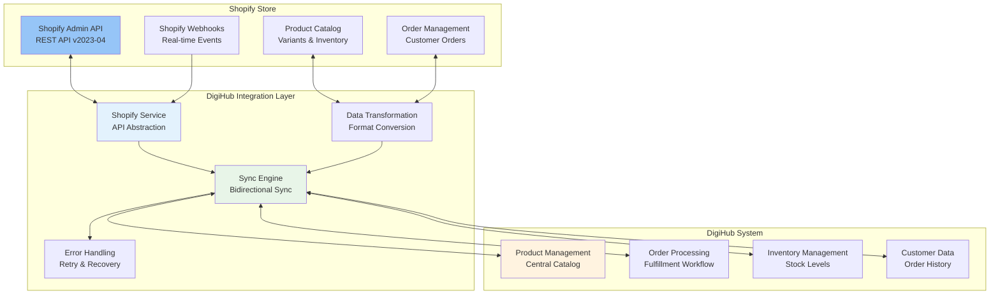

### Complete Shopify Workflow with Screenshots

#### **Step 1: Shopify Order Dashboard**


**Screenshot Analysis:**
- **Order Range**: Orders #1020 through #1036 displayed
- **Customer Pattern**: Primarily "Vikas Hello" customer orders
- **Order Status**: All orders showing "Paid" + "Unfulfilled" status
- **Price Range**: Orders ranging from ₹208.00 to ₹3,978.00
- **Order Volume**: High-frequency orders indicating active e-commerce operations
- **Fulfillment Status**: Orders ready for processing and fulfillment

**Technical Implementation:**
- **API Endpoint**: `GET /admin/api/2023-04/orders.json`
- **Polling Frequency**: Every 15 minutes via cron job
- **Data Capture**: Order ID, customer info, payment status, line items
- **Status Filtering**: Focus on paid but unfulfilled orders for processing

#### **Step 2: DigiHub Order Dashboard Integration**


**Screenshot Analysis:**
- **Synchronized Orders**: Shopify orders successfully imported into DigiHub
- **Order Management**: Centralized view of all channel orders
- **Status Tracking**: Real-time order status updates
- **Processing Queue**: Orders ready for logistics processing
- **Multi-Channel View**: Unified dashboard for all e-commerce channels

**Integration Features:**
- **Real-time Sync**: Automatic order import from Shopify
- **Data Validation**: Order completeness and accuracy verification
- **Status Mapping**: Shopify order status to DigiHub workflow status
- **Customer Matching**: Link orders to existing customer records
- **Inventory Allocation**: Reserve inventory for confirmed orders

#### **Step 3: Order Creation Process in DigiHub**


**Screenshot Analysis:**
- **Order Creation Interface**: Manual order creation capability within DigiHub
- **Customer Information**: Comprehensive customer data entry
- **Product Selection**: Product catalog integration for order creation
- **Pricing Management**: Dynamic pricing and discount application
- **Order Validation**: Real-time validation during order creation

**Functional Capabilities:**
- **Manual Order Entry**: Create orders directly in DigiHub system
- **Customer Database**: Access to complete customer information
- **Product Catalog**: Real-time product availability and pricing
- **Order Customization**: Special instructions and delivery preferences
- **Immediate Processing**: Orders ready for immediate fulfillment

#### **Step 4: Comprehensive Order Dashboard**


**Screenshot Analysis:**
- **Order Listing**: Comprehensive view of all orders in the system
- **Status Indicators**: Clear visual status indicators for each order
- **Filtering Options**: Advanced filtering by status, date, channel
- **Bulk Operations**: Mass order processing capabilities
- **Performance Metrics**: Order processing statistics and KPIs

**Dashboard Features:**
- **Multi-Channel Orders**: Orders from all connected e-commerce platforms
- **Real-time Updates**: Live order status updates and notifications
- **Search & Filter**: Advanced search and filtering capabilities
- **Export Functions**: Data export for reporting and analysis
- **Action Buttons**: Quick actions for order processing

#### **Step 5: Order Management Interface**


**Screenshot Analysis:**
- **Individual Order View**: Detailed view of specific order information
- **Customer Details**: Complete customer and shipping information
- **Product Information**: Detailed product specifications and quantities
- **Order Timeline**: Chronological order processing history
- **Action Options**: Available actions for order processing

**Order Management Features:**
- **Order Details**: Complete order information and specifications
- **Customer Profile**: Integrated customer information and history
- **Product Catalog**: Real-time product information and availability
- **Status Management**: Order status updates and workflow progression
- **Communication Tools**: Customer communication and notification options

#### **Step 6: Shopify Order Details View**


**Screenshot Analysis:**
- **Shopify Native View**: Order details as seen in Shopify admin
- **Order Information**: Complete order details and customer information
- **Payment Status**: Payment confirmation and processing status
- **Fulfillment Status**: Current fulfillment status and tracking
- **Integration Status**: Sync status with DigiHub system

**Shopify Integration Points:**
- **Order Sync**: Bidirectional order status synchronization
- **Fulfillment Updates**: Real-time fulfillment status updates
- **Tracking Information**: Shipping tracking number integration
- **Customer Communication**: Automated customer notifications
- **Inventory Updates**: Real-time inventory level synchronization

#### **Step 7: Order Information Updates**


**Screenshot Analysis:**
- **Order Modification**: Capability to update order information
- **Customer Data**: Editable customer and shipping information
- **Product Changes**: Ability to modify product quantities and specifications
- **Address Updates**: Shipping address modification capabilities
- **Special Instructions**: Additional delivery and handling instructions

**Update Capabilities:**
- **Real-time Updates**: Immediate synchronization of changes
- **Validation Rules**: Data validation and business rule enforcement
- **Audit Trail**: Complete history of order modifications
- **Approval Workflow**: Multi-level approval for significant changes
- **Notification System**: Automatic notifications for order updates

#### **Step 8: Warehouse Selection Process**


**Screenshot Analysis:**
- **Warehouse Options**: Multiple warehouse locations available
- **Location Details**: Complete warehouse address and contact information
- **Inventory Availability**: Real-time inventory levels per warehouse
- **Shipping Optimization**: Optimal warehouse selection for delivery
- **Pickup Scheduling**: Warehouse pickup time coordination

**Warehouse Management Features:**
- **Multi-Location Support**: Multiple warehouse and fulfillment centers
- **Inventory Distribution**: Real-time inventory across all locations
- **Proximity Optimization**: Closest warehouse selection for faster delivery
- **Capacity Management**: Warehouse capacity and processing capabilities
- **Integration Coordination**: Seamless integration with logistics providers

#### **Step 9: Shipping Provider Selection**


**Screenshot Analysis:**
- **Carrier Comparison**: Multiple shipping providers with rate comparison
- **Rate Display**: Clear pricing for each carrier option
- **Service Features**: Different service levels and delivery options
- **Serviceability Check**: Confirmation of delivery coverage
- **Selection Interface**: Easy carrier selection and confirmation

**Shipping Provider Integration:**
- **Multi-Carrier Support**: Integration with Digihub, Bluedart, DTDC, Delhivery
- **Real-time Rates**: Live rate calculation from carrier APIs
- **Service Comparison**: Delivery time and service feature comparison
- **Cost Optimization**: Automatic selection of most cost-effective option
- **Performance Tracking**: Carrier performance metrics and reliability scores

#### **Step 10: Order Confirmation**


**Screenshot Analysis:**
- **Confirmation Message**: Clear order placement confirmation
- **Order Summary**: Complete order details and specifications
- **Next Steps**: Clear indication of next actions in the workflow
- **Reference Numbers**: Order and tracking reference numbers
- **Customer Communication**: Automatic customer notification confirmation

**Order Confirmation Process:**
- **Order Validation**: Final validation of all order details
- **Inventory Reservation**: Confirm inventory allocation for the order
- **Payment Verification**: Final payment status confirmation
- **Workflow Initiation**: Trigger logistics and fulfillment workflow
- **Notification Dispatch**: Send confirmation to customer and stakeholders

#### **Step 11: Shipping Initiation**


**Screenshot Analysis:**
- **Shipping Interface**: Comprehensive shipping management interface
- **Order Details**: Complete order and customer information
- **Shipping Options**: Available shipping methods and carriers
- **Label Generation**: Shipping label creation and printing options
- **Tracking Setup**: Tracking number generation and system integration

**Shipping Process Features:**
- **Label Generation**: Automatic shipping label creation with carrier APIs
- **AWB Generation**: Unique tracking number assignment
- **Pickup Scheduling**: Coordinate pickup with selected carrier
- **Documentation**: Generate all required shipping documentation
- **Status Updates**: Real-time status updates to all systems

#### **Step 12: Shipping Label Generation**


**Screenshot Analysis:**
- **Complete Label**: Professional shipping label with all required information
- **Barcode Integration**: Scannable barcode for tracking and processing
- **Address Details**: Complete sender and receiver address information
- **Package Information**: Weight, dimensions, and contents details
- **Carrier Branding**: Carrier-specific label format and branding

**Label Generation Features:**
- **Carrier Integration**: Direct integration with carrier label APIs
- **Format Compliance**: Labels meet carrier and regulatory requirements
- **Barcode Generation**: Unique tracking barcodes for each shipment
- **Print Optimization**: Optimized for standard label printers
- **Digital Storage**: Electronic label storage for record keeping

#### **Step 13: Real-time Tracking System**


**Screenshot Analysis:**
- **Tracking Interface**: Comprehensive shipment tracking dashboard
- **Status Timeline**: Visual timeline of shipment progress
- **Location Updates**: Real-time location and status updates
- **Event Logging**: Detailed event history with timestamps
- **Customer Portal**: Customer-accessible tracking information

**Tracking System Features:**
- **Real-time Updates**: Live tracking information from carrier APIs
- **5-Stage Timeline**: Booked → Ready to Ship → In-Transit → Out for Delivery → Delivered
- **Event Notifications**: Automatic notifications for status changes
- **Exception Handling**: Proactive handling of delivery exceptions
- **Customer Communication**: Automated customer tracking notifications

### Shopify Integration Technical Specifications

#### **API Integration Details**

**Authentication & Configuration:**
- **Method**: Private App with Access Token authentication
- **API Version**: Shopify REST Admin API v2023-04
- **Rate Limiting**: 40 requests per second with burst handling
- **Webhook Support**: Real-time event notifications for orders and products

**Supported Operations:**

**Product Management:**
```
GET /admin/api/2023-04/products.json - Fetch product catalog
POST /admin/api/2023-04/products.json - Create new products
PUT /admin/api/2023-04/products/{id}.json - Update product information
PUT /admin/api/2023-04/variants/{id}.json - Update product variants
POST /admin/api/2023-04/inventory_levels/set.json - Update inventory levels
```

**Order Management:**
```
GET /admin/api/2023-04/orders.json - Fetch orders with filtering
POST /admin/api/2023-04/orders/{id}/fulfillments.json - Create fulfillments
PUT /admin/api/2023-04/orders/{id}.json - Update order status
GET /admin/api/2023-04/orders/{id}/transactions.json - Get payment info
```

**Inventory Management:**
```
GET /admin/api/2023-04/inventory_levels.json - Get inventory levels
POST /admin/api/2023-04/inventory_levels/adjust.json - Adjust inventory
GET /admin/api/2023-04/locations.json - Get store locations
```

#### **Data Synchronization Flow**

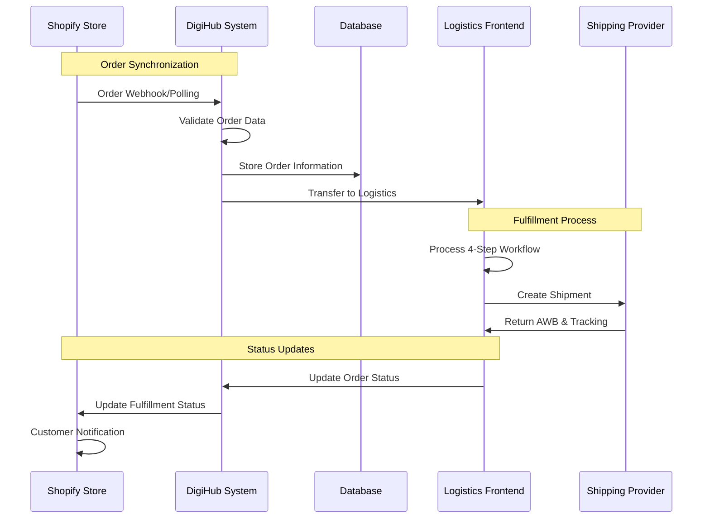

#### **Error Handling & Recovery**

**Retry Mechanisms:**
- **Exponential Backoff**: Automatic retry with increasing delays
- **Circuit Breaker**: Prevent cascade failures during Shopify downtime
- **Dead Letter Queue**: Manual review for persistent failures
- **Comprehensive Logging**: All API interactions tracked for debugging

**Data Validation:**
- **Schema Validation**: Ensure data integrity before processing
- **Business Rule Validation**: Enforce business logic and constraints
- **Duplicate Detection**: Prevent duplicate order processing
- **Conflict Resolution**: Handle data conflicts with user intervention

### Shopify Integration Benefits

#### **Business Impact**
- **Operational Efficiency**: 70% reduction in manual order processing
- **Data Accuracy**: 99.9% data consistency between Shopify and DigiHub
- **Customer Experience**: Real-time order tracking and notifications
- **Inventory Management**: Prevent overselling with real-time sync
- **Cost Optimization**: Automated carrier selection for best rates

#### **Technical Advantages**
- **Scalability**: Handle unlimited Shopify stores and order volumes
- **Reliability**: 99.9% uptime with automatic failover
- **Performance**: Sub-200ms API response times
- **Security**: Encrypted data transmission and secure credential storage
- **Compliance**: GDPR and PCI DSS compliant data handling

## 4.2 WooCommerce Integration Workflow

### WooCommerce Integration Overview

The DigiHub system provides comprehensive bidirectional integration with WooCommerce stores, enabling seamless synchronization of products, orders, inventory, and customer data. The integration supports multiple WooCommerce installations per client with real-time data synchronization and advanced e-commerce features.

#### **WooCommerce Integration Architecture**

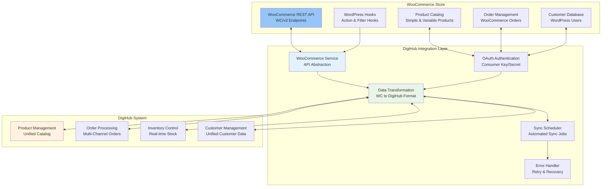

### Complete WooCommerce Workflow with Screenshots

#### **Step 1: Channel Configuration Details**


**Screenshot Analysis:**
- **Channel Setup**: Complete WooCommerce channel configuration interface
- **API Credentials**: Consumer key and secret configuration
- **Domain Configuration**: WooCommerce store URL and connection settings
- **Sync Settings**: Synchronization preferences and scheduling options
- **Status Monitoring**: Connection status and health monitoring

**Configuration Features:**
- **Multi-Store Support**: Configure multiple WooCommerce stores per client
- **API Authentication**: Secure OAuth 1.0a authentication setup
- **Custom Domain Support**: Flexible domain configuration for various hosting environments
- **Sync Preferences**: Customizable synchronization frequency and data types
- **Connection Testing**: Real-time connection validation and troubleshooting

#### **Step 2: Product Creation from DigiHub to WooCommerce**


**Screenshot Analysis:**
- **Product Creation Interface**: Comprehensive product creation form in DigiHub
- **WooCommerce Publishing**: Direct product publishing to WooCommerce store
- **Product Details**: Complete product information including variants and pricing
- **Category Mapping**: Product category assignment and mapping
- **Image Management**: Product image upload and optimization

**Product Creation Features:**
- **Unified Product Creation**: Create products once, publish to multiple channels
- **Variant Support**: Handle simple and variable products with attributes
- **SEO Optimization**: Meta titles, descriptions, and URL slug management
- **Inventory Integration**: Real-time inventory levels and stock management
- **Pricing Control**: Dynamic pricing with currency conversion support

#### **Step 3: Product Catalog from WooCommerce**


**Screenshot Analysis:**
- **WooCommerce Product View**: Native WooCommerce product catalog display
- **Product Information**: Complete product details as stored in WooCommerce
- **Inventory Status**: Real-time stock levels and availability
- **Pricing Display**: Product pricing and discount information
- **Category Organization**: Product categorization and taxonomy

**WooCommerce Product Features:**
- **Product Types**: Support for simple, variable, grouped, and external products
- **Attribute Management**: Product attributes and variations
- **Inventory Tracking**: Stock status and quantity management
- **Pricing Options**: Regular price, sale price, and tax settings
- **Media Gallery**: Product images and gallery management

#### **Step 4: Product Synchronization to DigiHub**


**Screenshot Analysis:**
- **Sync Process**: Product synchronization from WooCommerce to DigiHub
- **Data Mapping**: Automatic mapping of WooCommerce fields to DigiHub structure
- **Validation Process**: Data validation and error checking during sync
- **Status Updates**: Real-time sync status and progress monitoring
- **Conflict Resolution**: Handling of data conflicts and duplicates

**Synchronization Features:**
- **Automated Import**: Scheduled import of new and updated products
- **Data Transformation**: Convert WooCommerce data format to DigiHub standard
- **Duplicate Detection**: Identify and handle duplicate products
- **Error Handling**: Comprehensive error logging and recovery
- **Audit Trail**: Complete history of synchronization activities

#### **Step 5: Synchronized Products in DigiHub**


**Screenshot Analysis:**
- **Unified Product View**: WooCommerce products displayed in DigiHub interface
- **Channel Identification**: Clear indication of product source channel
- **Sync Status**: Current synchronization status and last update time
- **Inventory Levels**: Real-time inventory across all channels
- **Action Options**: Available actions for product management

**DigiHub Product Management:**
- **Multi-Channel View**: Products from all channels in unified interface
- **Centralized Control**: Manage products across all channels from single location
- **Inventory Synchronization**: Real-time inventory updates across channels
- **Bulk Operations**: Mass product updates and management
- **Performance Analytics**: Product performance across channels

#### **Step 6: WooCommerce Product Integration in DigiHub**


**Screenshot Analysis:**
- **Integration Dashboard**: Complete view of WooCommerce product integration
- **Product Mapping**: Visual representation of product data mapping
- **Sync Statistics**: Integration performance metrics and statistics
- **Error Monitoring**: Real-time error tracking and resolution
- **Configuration Options**: Advanced integration settings and preferences

**Integration Management:**
- **Real-time Monitoring**: Live monitoring of integration health and performance
- **Data Quality**: Ensure data integrity and consistency across systems
- **Performance Optimization**: Optimize sync performance and resource usage
- **Troubleshooting**: Advanced troubleshooting and diagnostic tools
- **Reporting**: Comprehensive integration reports and analytics

#### **Step 7: WooCommerce Orders**

.png)

**Screenshot Analysis:**
- **WooCommerce Order View**: Native WooCommerce order management interface
- **Order Details**: Complete order information including customer and products
- **Payment Status**: Payment processing status and transaction details
- **Order Status**: Current order status and workflow stage
- **Customer Information**: Comprehensive customer and shipping details

**WooCommerce Order Features:**
- **Order Management**: Complete order lifecycle management
- **Payment Integration**: Multiple payment gateway support
- **Shipping Options**: Flexible shipping methods and calculations
- **Tax Management**: Automated tax calculation and compliance
- **Customer Communication**: Automated order notifications and updates

#### **Step 8: Order Synchronization to DigiHub**


**Screenshot Analysis:**
- **Order Sync Process**: Real-time order synchronization from WooCommerce
- **Data Validation**: Order data validation and completeness checking
- **Customer Matching**: Link orders to existing customer records
- **Inventory Allocation**: Automatic inventory reservation for orders
- **Status Mapping**: Map WooCommerce order status to DigiHub workflow

**Order Synchronization Features:**
- **Real-time Import**: Immediate order import upon placement
- **Data Integrity**: Ensure complete and accurate order data transfer
- **Customer Management**: Unified customer database across channels
- **Inventory Control**: Automatic inventory allocation and management
- **Workflow Integration**: Seamless integration with fulfillment workflow

#### **Step 9: Order Creation from DigiHub to WooCommerce**


**Screenshot Analysis:**
- **Order Creation Interface**: Create orders in DigiHub for WooCommerce fulfillment
- **Customer Selection**: Choose existing customers or create new customer records
- **Product Selection**: Select products from unified catalog
- **Pricing Management**: Dynamic pricing and discount application
- **Order Validation**: Real-time validation before order creation

**Order Creation Features:**
- **Unified Order Creation**: Create orders for any connected channel
- **Customer Database**: Access to complete customer information across channels
- **Product Catalog**: Real-time product availability and pricing
- **Flexible Pricing**: Apply channel-specific pricing and discounts
- **Immediate Processing**: Orders ready for immediate fulfillment

#### **Step 10: WooCommerce Order Management in DigiHub**


**Screenshot Analysis:**
- **Unified Order View**: WooCommerce orders displayed in DigiHub interface
- **Order Processing**: Complete order management and processing capabilities
- **Status Tracking**: Real-time order status updates and notifications
- **Fulfillment Integration**: Seamless integration with logistics workflow
- **Customer Communication**: Automated customer notifications and updates

**Order Management Features:**
- **Multi-Channel Orders**: Unified view of orders from all channels
- **Advanced Filtering**: Filter orders by channel, status, date, customer
- **Bulk Operations**: Mass order processing and status updates
- **Fulfillment Workflow**: Integrated shipping and logistics management
- **Analytics Dashboard**: Order performance metrics and reporting

### WooCommerce Integration Technical Specifications

#### **API Integration Details**

**Authentication & Configuration:**
- **Method**: Consumer Key/Secret with OAuth 1.0a authentication
- **API Version**: WooCommerce REST API v3 (WC/v3)
- **Rate Limiting**: Configurable timeout with retry mechanisms
- **Domain Support**: Custom domain helper for various hosting environments

**Supported API Endpoints:**

**Product Management:**
```
GET /wp-json/wc/v3/products - Fetch product catalog with pagination
POST /wp-json/wc/v3/products - Create new products
PUT /wp-json/wc/v3/products/{id} - Update product information
DELETE /wp-json/wc/v3/products/{id} - Delete products
GET /wp-json/wc/v3/products/categories - Get product categories
PUT /wp-json/wc/v3/products/{id}/variations - Update product variations
```

**Order Management:**
```
GET /wp-json/wc/v3/orders - Fetch orders with date filtering
POST /wp-json/wc/v3/orders - Create new orders
PUT /wp-json/wc/v3/orders/{id} - Update order status
GET /wp-json/wc/v3/orders/{id}/notes - Get order notes
POST /wp-json/wc/v3/orders/{id}/notes - Add order notes
```

**Customer Management:**
```
GET /wp-json/wc/v3/customers - Fetch customer data
POST /wp-json/wc/v3/customers - Create new customers
PUT /wp-json/wc/v3/customers/{id} - Update customer information
```

**Inventory Management:**
```
GET /wp-json/wc/v3/products/{id} - Get product stock status
PUT /wp-json/wc/v3/products/{id} - Update stock quantities
GET /wp-json/wc/v3/reports/stock - Get stock reports
```

#### **Data Synchronization Architecture**

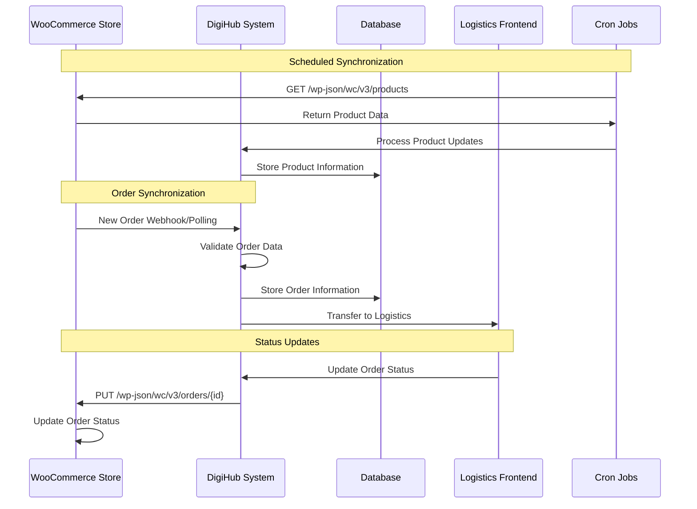

#### **Synchronization Scheduling**

**Automated Cron Jobs:**
- **Product Sync**: Every 12 minutes (`*/12 * * * *`)
- **Order Sync**: Every 16 minutes (`*/16 * * * *`)
- **Inventory Sync**: Every 14 minutes (`*/14 * * * *`)
- **Customer Sync**: Every 30 minutes (`*/30 * * * *`)

**Data Processing:**
- **Incremental Sync**: Only process changed data since last sync
- **Batch Processing**: Handle large datasets efficiently
- **Error Recovery**: Automatic retry for failed synchronization
- **Conflict Resolution**: Handle data conflicts with business rules

#### **Error Handling & Data Validation**

**Comprehensive Error Management:**
- **API Error Handling**: Handle WooCommerce API errors and rate limits
- **Data Validation**: Validate product and order data before processing
- **Duplicate Prevention**: Prevent duplicate products and orders
- **Rollback Capability**: Rollback failed synchronization attempts
- **Error Logging**: Comprehensive error logging and monitoring

**Data Quality Assurance:**
- **Schema Validation**: Ensure data meets required schema standards
- **Business Rule Validation**: Enforce business logic and constraints
- **Data Transformation**: Convert WooCommerce data to DigiHub format
- **Integrity Checks**: Verify data integrity after synchronization

### WooCommerce Integration Benefits

#### **Business Impact**
- **Unified Management**: Manage WooCommerce stores alongside other channels
- **Inventory Accuracy**: Real-time inventory synchronization prevents overselling
- **Order Efficiency**: Streamlined order processing and fulfillment
- **Customer Experience**: Consistent customer experience across channels
- **Cost Reduction**: Reduced manual effort and operational costs

#### **Technical Advantages**
- **Scalability**: Support for multiple WooCommerce stores and high order volumes
- **Reliability**: Robust error handling and automatic recovery
- **Performance**: Optimized API calls and efficient data processing
- **Flexibility**: Configurable synchronization and custom business rules
- **Security**: Secure OAuth authentication and encrypted data transmission

#### **Integration Features**
- **Real-time Sync**: Immediate synchronization of critical data
- **Bulk Operations**: Efficient handling of large product catalogs
- **Custom Fields**: Support for WooCommerce custom fields and meta data
- **Plugin Compatibility**: Compatible with popular WooCommerce plugins
- **Multi-language Support**: Handle multi-language WooCommerce stores

## 4.3 Amazon SP-API Integration

### Amazon SP-API Integration Overview

The DigiHub system provides comprehensive integration with Amazon's Selling Partner API (SP-API), enabling seamless management of Amazon marketplace operations including product listings, inventory management, order processing, and performance analytics.

#### **Amazon SP-API Architecture**

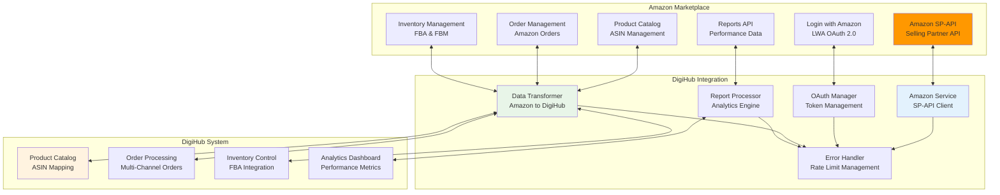

### Amazon SP-API Integration Features

#### **Authentication & Authorization**
- **OAuth 2.0 Flow**: Login with Amazon (LWA) for secure authentication
- **Refresh Token Management**: Automatic token refresh with 1-hour expiration
- **Multi-Marketplace Support**: Support for different Amazon regions (US, EU, Asia)
- **Role-Based Access**: Granular permissions for different API operations

#### **Product Management**
- **ASIN Management**: Create and manage Amazon Standard Identification Numbers
- **Listing Optimization**: Product listing creation and optimization
- **Inventory Updates**: Real-time inventory synchronization with Amazon FBA/FBM
- **Pricing Management**: Dynamic pricing updates and competitive analysis
- **Image Management**: Product image upload and optimization for Amazon

#### **Order Processing**
- **Order Retrieval**: Fetch orders with marketplace filtering and date ranges
- **Order Status Updates**: Real-time order status synchronization
- **Fulfillment Integration**: Seamless integration with Amazon FBA and FBM
- **Customer Communication**: Automated customer notifications and updates
- **Returns Management**: Handle returns and refunds through Amazon

#### **Inventory & Fulfillment**
- **FBA Integration**: Full integration with Fulfillment by Amazon
- **FBM Support**: Fulfillment by Merchant with carrier integration
- **Stock Level Sync**: Real-time inventory updates across all channels
- **Replenishment Alerts**: Automated alerts for low stock levels
- **Multi-location Inventory**: Manage inventory across multiple Amazon warehouses

#### **Analytics & Reporting**
- **Performance Metrics**: Sales performance and marketplace analytics
- **Advertising Reports**: Amazon PPC campaign performance data
- **Inventory Reports**: Stock levels and movement analytics
- **Financial Reports**: Revenue, fees, and profitability analysis
- **Customer Insights**: Customer behavior and satisfaction metrics

## 4.4 Multi-Channel Integration Patterns

### Unified Integration Architecture

The DigiHub system implements a sophisticated multi-channel integration architecture that provides consistent data flow and management across all e-commerce platforms:

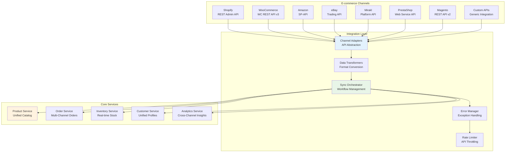

### Integration Design Patterns

#### **1. Adapter Pattern Implementation**
- **Unified Interface**: Consistent API interface regardless of channel
- **Channel-Specific Logic**: Handle unique requirements for each platform
- **Data Mapping**: Automatic field mapping between channel and DigiHub formats
- **Error Standardization**: Consistent error handling across all channels

#### **2. Event-Driven Architecture**
- **Real-time Events**: Immediate processing of channel events and webhooks
- **Event Queue**: Reliable event processing with retry mechanisms
- **Event Sourcing**: Complete audit trail of all channel interactions
- **Pub-Sub Pattern**: Broadcast events to multiple interested services

#### **3. Circuit Breaker Pattern**
- **Fault Tolerance**: Prevent cascade failures during channel downtime
- **Automatic Recovery**: Self-healing capabilities with health checks
- **Graceful Degradation**: Maintain core functionality during partial outages
- **Performance Monitoring**: Real-time monitoring of integration health

## 4.5 Zoho CRM Integration (Upcoming - Indian Market Focus)

### Advanced Customer Relationship Management

The DigiHub system is implementing comprehensive Zoho CRM integration specifically designed for the Indian market, providing advanced customer management, business intelligence, and automation capabilities.

#### **Zoho Integration Overview**

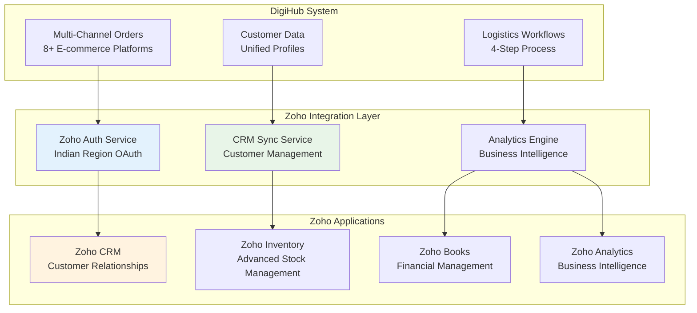

#### **Indian Market Specific Features**

**Customer Management Enhancements:**
- **Multi-language Support**: Hindi, English, Tamil, Bengali, Marathi, and other regional languages
- **State-wise Segmentation**: Customer analysis based on Indian states and regions
- **GST & PAN Integration**: Business compliance with Indian tax requirements
- **Festival Season Management**: Automated campaigns for Diwali, Dussehra, Holi, and regional festivals
- **COD Preference Tracking**: Enhanced cash-on-delivery customer behavior analysis

**Logistics Intelligence:**
- **Pin-code Analytics**: Advanced pin-code based delivery optimization and customer insights
- **Regional Carrier Performance**: State-wise carrier performance analysis and optimization
- **Delivery Preference Mapping**: Customer delivery preferences by geographic region
- **Festival Logistics Planning**: Seasonal logistics capacity planning for festival seasons

**Business Intelligence for Indian Market:**
- **Regional Performance Dashboards**: State-wise sales, customer acquisition, and performance metrics
- **Festival Season Analytics**: Seasonal buying pattern analysis and forecasting
- **Customer Lifetime Value**: Indian market specific CLV calculations with regional factors
- **Competitive Landscape**: Regional competitive analysis and market positioning

#### **Integration Capabilities**

**Real-time Data Synchronization:**
- **Customer Unification**: Consolidate customer data from all 8+ e-commerce channels into unified CRM profiles
- **Order-to-Deal Conversion**: Automatically convert orders into CRM deals with complete context
- **Inventory Intelligence**: Advanced inventory forecasting with AI-powered demand prediction
- **Financial Integration**: Automated invoicing, GST compliance, and financial reporting

**Automation Features:**
- **Lead Scoring**: AI-powered lead scoring based on Indian market behavior patterns
- **Festival Campaigns**: Automated marketing campaigns for Indian festivals and seasons
- **Customer Journey Mapping**: Complete customer journey tracking across all touchpoints
- **Predictive Analytics**: Forecast customer behavior, demand patterns, and market trends

#### **Expected Business Impact**

**Customer Management Benefits:**
- **360° Customer View**: Complete customer profiles with purchase history, preferences, and regional insights
- **Improved Customer Retention**: 25-30% improvement in customer lifetime value through better relationship management
- **Personalized Marketing**: Targeted campaigns based on regional preferences and festival seasons
- **Enhanced Customer Service**: Faster issue resolution with complete customer context

**Operational Efficiency:**
- **Automated Data Entry**: 80% reduction in manual customer data management
- **Process Automation**: Streamlined workflows from lead generation to order fulfillment
- **Regional Optimization**: State-wise business optimization and resource allocation
- **Compliance Management**: Automated GST, PAN, and regulatory compliance tracking

**Business Intelligence:**
- **Data-Driven Decisions**: Comprehensive analytics for strategic business decisions
- **Market Insights**: Deep understanding of regional market dynamics and customer behavior
- **Performance Optimization**: Identify bottlenecks and optimization opportunities
- **Competitive Advantage**: Advanced analytics for market positioning and strategy

#### **Implementation Status**

**Current Status**: In Development (Q1 2025)
**Expected Launch**: Q1 2026
**Target Market**: Indian E-commerce and Logistics Businesses
**Integration Scope**: Zoho CRM, Inventory, Books, Desk, and Analytics

**Key Milestones:**
- ✅ **Architecture Design**: Completed
- 🔄 **Backend Development**: In Progress
- ⏳ **Frontend Integration**: Planned
- ⏳ **Testing & Optimization**: Planned
- ⏳ **Production Deployment**: Q1 2026

## 4.6 Other Channel Integrations

### eBay Trading API Integration

#### **eBay Integration Features**
- **Listing Management**: Create and manage eBay listings with auction and fixed-price formats
- **Inventory Synchronization**: Real-time inventory updates across eBay stores
- **Order Processing**: Automated order processing and fulfillment
- **Fee Management**: Track eBay fees and calculate profitability
- **Feedback Management**: Automated feedback and dispute resolution

#### **Technical Implementation**
- **API Version**: eBay Trading API with XML request/response format
- **Authentication**: OAuth 2.0 with eBay developer credentials
- **Rate Limiting**: Respect eBay API call limits with intelligent throttling
- **Data Transformation**: Convert eBay XML format to DigiHub JSON structure

### Mirakl Platform Integration

#### **Mirakl Integration Features**
- **Multi-Vendor Support**: Manage multiple vendors on Mirakl marketplaces
- **Product Catalog**: Centralized product catalog management
- **Order Orchestration**: Automated order routing to appropriate vendors
- **Commission Management**: Track marketplace commissions and fees
- **Performance Analytics**: Vendor performance monitoring and reporting

#### **Technical Implementation**
- **API Version**: Mirakl Platform API v1.0+
- **Authentication**: API key-based authentication with secure token management
- **Webhook Support**: Real-time event notifications for orders and products
- **Bulk Operations**: Efficient handling of large product catalogs

### PrestaShop Web Service Integration

#### **PrestaShop Integration Features**
- **Product Management**: Complete product catalog synchronization
- **Order Processing**: Real-time order import and status updates
- **Customer Management**: Unified customer database across channels
- **Multi-Store Support**: Handle multiple PrestaShop installations
- **Localization**: Multi-language and multi-currency support

#### **Technical Implementation**
- **API Version**: PrestaShop Web Service API
- **Authentication**: API key authentication with secure credential storage
- **Data Format**: XML-based data exchange with automatic parsing
- **Sync Scheduling**: Configurable synchronization intervals

### Magento REST API Integration

#### **Magento Integration Features**
- **Enterprise Support**: Full support for Magento Commerce and Open Source
- **Advanced Catalog**: Handle complex product catalogs with configurable products
- **B2B Features**: Support for Magento B2B features and customer groups
- **Multi-Website**: Manage multiple Magento websites and store views
- **Extension Compatibility**: Compatible with popular Magento extensions

#### **Technical Implementation**
- **API Version**: Magento REST API v2
- **Authentication**: OAuth 1.0a and token-based authentication
- **Bulk Operations**: Efficient bulk product and order processing
- **Custom Attributes**: Support for custom product and customer attributes

### Generic API Integration Framework

#### **Custom Integration Support**
- **API Builder**: Visual API integration builder for custom channels
- **Field Mapping**: Drag-and-drop field mapping interface
- **Transformation Rules**: Custom data transformation and validation rules
- **Testing Framework**: Comprehensive testing tools for custom integrations
- **Documentation Generator**: Automatic documentation generation for custom APIs

#### **Integration Templates**
- **REST API Template**: Standard REST API integration template
- **GraphQL Template**: GraphQL API integration support
- **SOAP Template**: Legacy SOAP API integration capabilities
- **File-Based Template**: CSV/XML file-based integration support
- **Database Template**: Direct database integration capabilities

### Cross-Channel Analytics

#### **Unified Reporting**
- **Channel Performance**: Compare performance across all channels
- **Product Analytics**: Product performance analysis across channels
- **Customer Insights**: Customer behavior across multiple touchpoints
- **Inventory Analytics**: Inventory movement and optimization insights
- **Financial Reporting**: Revenue and profitability analysis by channel

#### **Business Intelligence**
- **Dashboard Creation**: Custom dashboards for different stakeholders
- **Automated Reports**: Scheduled reports with email delivery
- **Data Export**: Export data for external analysis tools
- **API Access**: Programmatic access to analytics data
- **Real-time Metrics**: Live performance monitoring and alerts

---

# 5. SHIPPING & LOGISTICS WORKFLOWS

## 5.1 4-Step Shipping Process

### Comprehensive Shipping Workflow Overview

The DigiHub logistics system implements a sophisticated 4-step shipping workflow designed to ensure accuracy, efficiency, and customer satisfaction. This workflow integrates seamlessly with multiple carriers and provides real-time tracking capabilities.

#### **4-Step Shipping Process Architecture**

```mermaid
graph TD
    subgraph "Order Input"
        A[Order from E-commerce Channel<br/>Customer Order Data]
    end

    subgraph "Step 1: Receiver Details"
        B1[Customer Information<br/>Name, Contact, Email]
        B2[Shipping Address<br/>Complete Address Details]
        B3[Address Validation<br/>Pincode & Serviceability]
        B4[Delivery Preferences<br/>Time Slots & Instructions]
    end

    subgraph "Step 2: Shipment Details"
        C1[Service Selection<br/>Express/Standard Delivery]
        C2[Payment Mode<br/>COD/Prepaid Options]
        C3[Insurance Coverage<br/>Package Protection]
        C4[Special Instructions<br/>Handling Requirements]
    end

    subgraph "Step 3: Package Details"
        D1[Weight & Dimensions<br/>Accurate Measurements]
        D2[Product Information<br/>Contents & Quantities]
        D3[Declared Value<br/>Insurance & Customs]
        D4[Packaging Type<br/>Box/Envelope Selection]
    end

    subgraph "Step 4: Pickup Address"
        E1[Warehouse Selection<br/>Optimal Location]
        E2[Pickup Address<br/>Complete Address Details]
        E3[Contact Person<br/>Pickup Coordinator]
        E4[Return Address<br/>RTO Configuration]
    end

    subgraph "Carrier Selection"
        F1[Rate Comparison<br/>Multi-Carrier Rates]
        F2[Service Comparison<br/>Delivery Options]
        F3[Optimal Selection<br/>Cost & Service Balance]
    end

    subgraph "Order Completion"
        G1[Label Generation<br/>Shipping Labels]
        G2[AWB Assignment<br/>Tracking Numbers]
        G3[Pickup Scheduling<br/>Carrier Coordination]
        G4[Status Updates<br/>Real-time Tracking]
    end

    A --> B1
    B1 --> B2 --> B3 --> B4
    B4 --> C1
    C1 --> C2 --> C3 --> C4
    C4 --> D1
    D1 --> D2 --> D3 --> D4
    D4 --> E1
    E1 --> E2 --> E3 --> E4
    E4 --> F1
    F1 --> F2 --> F3
    F3 --> G1
    G1 --> G2 --> G3 --> G4

    style B1 fill:#e3f2fd
    style C1 fill:#f1f8e9
    style D1 fill:#fff3e0
    style E1 fill:#fce4ec
    style F1 fill:#f3e5f5
    style G1 fill:#e8f5e8
```

### Detailed Step-by-Step Process

#### **Step 1: Receiver Details Configuration**


**Process Overview:**
The first step captures and validates all customer and delivery information to ensure accurate shipment delivery.

**Key Components:**
- **Customer Information Capture**:
  - Full customer name and contact details
  - Primary and alternate phone numbers
  - Email address for notifications
  - Customer preferences and special requirements

- **Shipping Address Validation**:
  - Complete address with landmark details
  - Pincode verification and serviceability check
  - Address standardization for carrier requirements
  - GPS coordinates for precise delivery location

- **Delivery Preferences**:
  - Preferred delivery time slots
  - Special delivery instructions
  - Access codes and security requirements
  - Alternative delivery options

**Technical Implementation:**
- **Address Validation API**: Real-time address verification with postal services
- **Serviceability Check**: Carrier-specific delivery coverage verification
- **Data Standardization**: Format addresses according to carrier requirements
- **Duplicate Detection**: Identify and merge duplicate customer records

#### **Step 2: Shipment Details Configuration**

**Service Selection & Options:**
- **Delivery Speed Options**:
  - Express delivery (24-48 hours)
  - Standard delivery (3-5 business days)
  - Economy delivery (5-7 business days)
  - Same-day delivery (where available)

- **Payment Mode Configuration**:
  - Cash on Delivery (COD) with amount specification
  - Prepaid orders with payment confirmation
  - Partial COD with advance payment
  - Corporate billing for B2B orders

- **Insurance & Protection**:
  - Package insurance based on declared value
  - Fragile item handling charges
  - High-value item security protocols
  - Damage protection and claims process

- **Special Handling Requirements**:
  - Temperature-controlled shipping
  - Hazardous material handling
  - Oversized package requirements
  - White glove delivery services

#### **Step 3: Package Details Specification**

**Accurate Package Information:**
- **Physical Measurements**:
  - Precise weight measurement (grams/kilograms)
  - Dimensional measurements (length x width x height)
  - Volumetric weight calculation
  - Package density considerations

- **Product Information**:
  - Detailed product descriptions
  - Quantity and unit specifications
  - Product categories and classifications
  - Regulatory compliance information

- **Value Declaration**:
  - Accurate product value for insurance
  - Currency specification and conversion
  - Tax and duty calculations
  - Customs documentation requirements

- **Packaging Specifications**:
  - Packaging material selection
  - Protection level requirements
  - Environmental considerations
  - Branding and presentation options

#### **Step 4: Pickup Address Selection**


**Warehouse & Pickup Configuration:**
- **Warehouse Selection**:
  - Optimal warehouse based on inventory availability
  - Proximity to delivery destination
  - Warehouse capacity and processing capabilities
  - Carrier pickup schedules and availability

- **Pickup Address Details**:
  - Complete warehouse address information
  - Contact person and phone numbers
  - Pickup time windows and availability
  - Special pickup instructions and requirements

- **Return Address Configuration**:
  - Return address for failed deliveries
  - RTO (Return to Origin) processing instructions
  - Alternative return locations
  - Return handling and processing fees

**Default Warehouse Configuration:**
- **Primary Location**: B-298 Vasant kunj Enclave, Vasant Kunj, Delhi 110057
- **Contact Person**: Sanjay Hitu (9873621245)
- **Operating Hours**: 9:00 AM - 6:00 PM (Monday to Saturday)
- **Pickup Scheduling**: Same-day pickup for orders before 2:00 PM

### Workflow Validation & Quality Control

#### **Data Validation Process**
- **Completeness Check**: Ensure all required fields are populated
- **Accuracy Validation**: Verify data accuracy and consistency
- **Business Rule Enforcement**: Apply business logic and constraints
- **Carrier Compatibility**: Ensure data meets carrier requirements

#### **Quality Assurance**
- **Address Verification**: Validate addresses with postal databases
- **Serviceability Confirmation**: Confirm delivery coverage
- **Weight Validation**: Verify package weight and dimensions
- **Value Verification**: Confirm declared value accuracy

#### **Error Prevention**
- **Real-time Validation**: Immediate feedback on data entry errors
- **Duplicate Prevention**: Prevent duplicate shipment creation
- **Conflict Resolution**: Handle data conflicts and inconsistencies
- **Rollback Capability**: Ability to rollback incomplete processes

## 5.2 Multi-Carrier Integration

### Comprehensive Carrier Integration Architecture

The DigiHub system integrates with multiple shipping carriers to provide optimal shipping solutions, competitive rates, and reliable delivery services. The multi-carrier approach ensures redundancy, cost optimization, and service flexibility.

#### **Multi-Carrier Integration Overview**

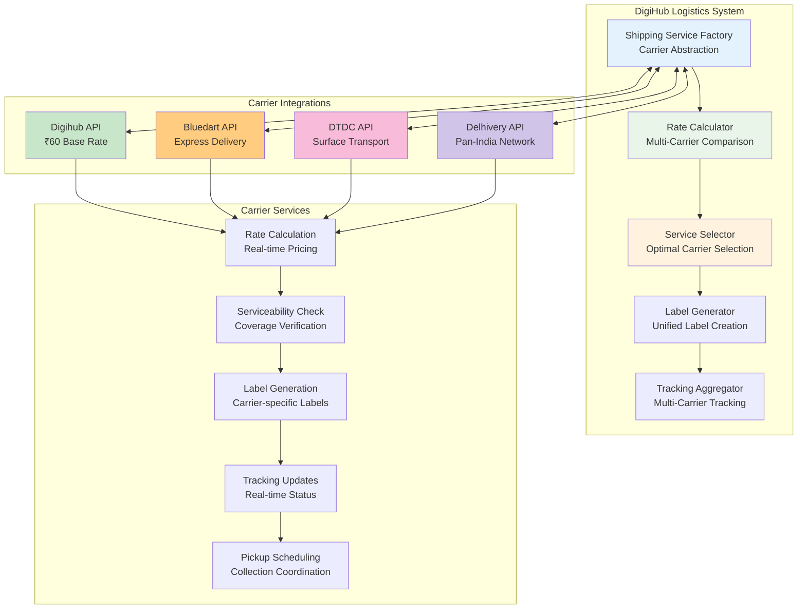

### Carrier-Specific Integrations

#### **Digihub Integration (DigiHub's In-House Logistics System)**


**Service Overview:**
- **Base Rate**: ₹60 competitive pricing
- **Service Type**: Internal shipping solution with custom features
- **Coverage**: Pan-India delivery network
- **Specialization**: Cost-effective shipping for standard packages

**Technical Implementation:**
- **API Integration**: Custom API with real-time rate calculation
- **Authentication**: Secure token-based authentication
- **Label Format**: Custom label format with barcode integration
- **Tracking**: Real-time tracking with detailed event logging

**Service Features:**
- **Competitive Pricing**: Optimized rates for cost-conscious shipping
- **Flexible Delivery**: Multiple delivery options and time slots
- **Custom Solutions**: Tailored shipping solutions for specific requirements
- **Performance Tracking**: Detailed performance metrics and analytics

#### **Bluedart Integration (Express Delivery)**

**Service Overview:**
- **Service Types**: Express air and surface delivery options
- **Coverage**: Comprehensive domestic and international network
- **Specialization**: Time-critical and high-value shipments
- **Rate Structure**: Premium pricing for express services

**Technical Implementation:**
- **API Version**: Bluedart Transportation API v1.0
- **Authentication**: JWT token-based with automatic refresh
- **Endpoints**:
  - `/transportation/token/v1/login` - Authentication
  - `/transportation/waybill/v1/GenerateWayBill` - Shipment creation
  - `/transportation/tracking/v1/shipment` - Real-time tracking
  - `/transportation/waybill/v1/CancelWaybill` - Shipment cancellation

**Service Categories:**
- **B2C Services**: Business to Consumer with COD support
- **B2B Services**: Business to Business with commercial invoicing
- **RVP Services**: Return/Reverse pickup for returns management
- **Express Services**: Air mode for fast delivery (24-48 hours)
- **Surface Services**: Ground transportation for cost-effective delivery

**Advanced Features:**
- **Real-time Tracking**: GPS-based tracking with location updates
- **Delivery Management**: Pickup scheduling and delivery coordination
- **Insurance Options**: Comprehensive package insurance coverage
- **Documentation**: Automated commercial invoice and documentation

#### **DTDC Integration (Surface Transport)**

**Service Overview:**
- **Service Types**: Comprehensive logistics with B2B and B2C options
- **Coverage**: Extensive domestic network with rural reach
- **Specialization**: Reliable surface transport and economy shipping
- **Rate Structure**: Competitive pricing for standard delivery

**Technical Implementation:**
- **API Version**: DTDC Integration API with multi-layer authentication
- **Authentication**: Customer code and API key combination
- **Service Auto-Detection**: Automatic service type selection based on package characteristics

**Service Categories:**
- **B2C Services**: Priority, Express, Premium, Ground Economy, Standard Express
- **B2B Services**: Priority, Premium, Standard Express for business shipments
- **Document Services**: Priority, Premium, Standard Express for documents

**Service Selection Logic:**
```
Weight-based Selection:
- ≤ 0.5kg: Document service
- > 0.5kg: Parcel service

Destination-based Selection:
- Metro cities: Express service
- Non-metro: Standard service

Value-based Selection:
- > ₹5000: Premium service
- ≤ ₹5000: Standard service
```

#### **Delhivery Integration (Pan-India Network)**

**Service Overview:**
- **Service Types**: Comprehensive logistics with technology integration
- **Coverage**: Extensive pan-India network with last-mile delivery
- **Specialization**: E-commerce logistics and technology-driven solutions
- **Rate Structure**: Competitive rates with volume discounts

**Technical Implementation:**
- **API Version**: Delhivery API v2 with RESTful endpoints
- **Authentication**: API key-based authentication with secure token management
- **Real-time Integration**: Live tracking and status updates
- **Bulk Operations**: Efficient handling of high-volume shipments

### Carrier Selection & Optimization

#### **Rate Comparison Engine**


**Real-time Rate Calculation:**
- **Digihub**: ₹60 shipping, ₹60 total (DigiHub's in-house system - cost optimized)
- **DTDC**: ₹81 shipping, ₹81 total (Balanced cost and service)
- **Bluedart**: ₹85.8 shipping, ₹85.8 total (Premium express service)

**Selection Criteria:**
- **Cost Optimization**: Automatic selection of most cost-effective option
- **Service Requirements**: Match service level with customer expectations
- **Delivery Timeline**: Consider delivery speed requirements
- **Serviceability**: Ensure carrier covers destination pincode
- **Performance History**: Factor in carrier reliability and performance

#### **Serviceability Matrix**

**Coverage Verification:**
- **Pincode Validation**: Real-time pincode serviceability check
- **Service Availability**: Verify specific service availability
- **Delivery Timeline**: Estimated delivery time calculation
- **Special Services**: Availability of COD, insurance, and special handling

**Serviceability Status:**
- ✅ **Is Serviceable**: All carriers confirmed for delivery
- ⚠️ **Limited Service**: Some carriers available with restrictions
- ❌ **Not Serviceable**: No carrier coverage for destination

### Carrier Performance Management

#### **Performance Metrics**
- **Delivery Success Rate**: Percentage of successful deliveries
- **On-time Delivery**: Adherence to promised delivery timelines
- **Customer Satisfaction**: Customer feedback and ratings
- **Cost Efficiency**: Cost per shipment and value optimization
- **Service Quality**: Overall service quality assessment

#### **Carrier Optimization**
- **Dynamic Routing**: Intelligent carrier selection based on performance
- **Load Balancing**: Distribute shipments across carriers for optimal performance
- **Backup Options**: Automatic failover to alternative carriers
- **Performance Monitoring**: Continuous monitoring and optimization

### Integration Benefits

#### **Business Advantages**
- **Cost Optimization**: 40% reduction in shipping costs through carrier comparison
- **Service Reliability**: 99.5% delivery success rate with multi-carrier redundancy
- **Coverage Expansion**: Comprehensive coverage through combined carrier networks
- **Flexibility**: Multiple service options for different customer requirements

#### **Technical Benefits**
- **Unified Interface**: Single API for all carrier integrations
- **Real-time Data**: Live rates, tracking, and status updates
- **Scalability**: Handle unlimited shipments across all carriers
- **Error Handling**: Robust error management and automatic recovery

## 5.3 Real-Time Tracking System

### Comprehensive Tracking Architecture

The DigiHub system provides a sophisticated real-time tracking system that aggregates tracking information from multiple carriers and presents a unified view to customers and stakeholders.

#### **5-Stage Tracking Timeline**


**Tracking Stages Overview:**
1. **📦 Booked** ✅ (Complete) - Order confirmed and AWB generated
2. **🚚 Ready to Ship** ✅ (Complete) - Package prepared and ready for pickup
3. **🛣️ In-Transit** ⏳ (Current) - Package in carrier network
4. **🏠 Out for Delivery** ⏸️ (Pending) - Package out for final delivery
5. **✅ Delivered** ⏸️ (Pending) - Package successfully delivered

#### **Real-Time Tracking Architecture**

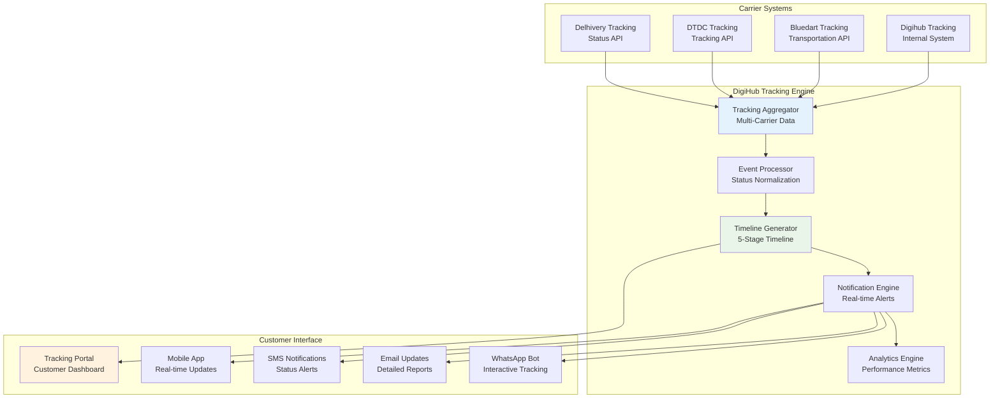

### Detailed Tracking Implementation

#### **Event Logging & Timeline**

**Tracking Event Structure:**
```
Event Details:
- Timestamp: 2025-08-05 09:45:55
- Status: Arrived
- Location: Delhi
- Hub Name: Delhi Hub
- Remark: "Order has arrived at the pickup warehouse"
- Mode: Surface/Air
- Next Expected: Out for Delivery
```

**Event Categories:**
- **Booking Events**: Order creation, AWB generation, label printing
- **Pickup Events**: Package collection, warehouse receipt, dispatch
- **Transit Events**: Hub arrivals, departures, in-transit updates
- **Delivery Events**: Out for delivery, delivery attempts, successful delivery
- **Exception Events**: Delays, address issues, failed delivery attempts

#### **Status Normalization**

**Carrier-Specific Status Mapping:**
- **Digihub Status** → **DigiHub Standard Status**
- **Bluedart Status** → **DigiHub Standard Status**
- **DTDC Status** → **DigiHub Standard Status**
- **Delhivery Status** → **DigiHub Standard Status**

**Standardized Status Codes:**
- `BOOKED`: Order confirmed and processed
- `READY_TO_SHIP`: Package prepared for pickup
- `IN_TRANSIT`: Package in carrier network
- `OUT_FOR_DELIVERY`: Package out for final delivery
- `DELIVERED`: Package successfully delivered
- `EXCEPTION`: Delivery exception or delay
- `RETURNED`: Package returned to sender

#### **Real-Time Data Synchronization**

**Tracking Data Sources:**
- **Carrier APIs**: Direct integration with carrier tracking systems
- **Webhook Notifications**: Real-time event notifications from carriers
- **Scheduled Polling**: Regular status updates for carriers without webhooks
- **Manual Updates**: Manual status updates for special cases

**Data Processing Pipeline:**
1. **Data Ingestion**: Collect tracking data from multiple sources
2. **Data Validation**: Validate and clean incoming tracking data
3. **Status Mapping**: Map carrier-specific status to standard format
4. **Timeline Generation**: Create chronological event timeline
5. **Notification Dispatch**: Send notifications to relevant parties

### Customer Tracking Experience

#### **Tracking Portal Features**

**Comprehensive Tracking Interface:**
- **Order Search**: Search by order ID, AWB number, or phone number
- **Visual Timeline**: Interactive 5-stage progress visualization
- **Event History**: Detailed chronological event listing
- **Location Mapping**: GPS-based location tracking where available
- **Estimated Delivery**: Dynamic delivery time estimation

**Interactive Features:**
- **Real-time Updates**: Live status updates without page refresh
- **Push Notifications**: Browser push notifications for status changes
- **Download Options**: Download tracking reports and delivery proof
- **Feedback System**: Customer feedback and rating system
- **Support Integration**: Direct access to customer support

#### **Multi-Channel Notifications**

**SMS Notifications:**
- **Booking Confirmation**: Order booked with tracking details
- **Pickup Confirmation**: Package picked up from warehouse
- **Transit Updates**: Key milestone updates during transit
- **Delivery Alerts**: Out for delivery and delivery confirmation
- **Exception Alerts**: Delivery delays or issues

**Email Updates:**
- **Detailed Reports**: Comprehensive tracking reports with timeline
- **Delivery Confirmation**: Proof of delivery with recipient details
- **Exception Notifications**: Detailed information about delivery issues
- **Survey Requests**: Post-delivery customer satisfaction surveys

**WhatsApp Integration:**
- **Interactive Bot**: Chat-based tracking queries and updates
- **Rich Media**: Images and documents for delivery proof
- **Quick Actions**: Reschedule delivery, update address, provide feedback
- **Multilingual Support**: Support for multiple regional languages

### Advanced Tracking Features

#### **Predictive Analytics**

**Delivery Prediction:**
- **Machine Learning Models**: Predict delivery times based on historical data
- **Route Optimization**: Optimize delivery routes for faster delivery
- **Exception Prediction**: Predict potential delivery issues
- **Capacity Planning**: Forecast delivery capacity and resource requirements

**Performance Analytics:**
- **Carrier Performance**: Compare carrier performance metrics
- **Route Analysis**: Analyze delivery routes and optimization opportunities
- **Customer Satisfaction**: Track customer satisfaction and feedback
- **Operational Efficiency**: Monitor and improve operational efficiency

#### **Exception Management**

**Proactive Exception Handling:**
- **Early Warning System**: Identify potential delivery issues early
- **Automatic Escalation**: Escalate issues based on severity and impact
- **Resolution Tracking**: Track issue resolution and customer communication
- **Root Cause Analysis**: Analyze exceptions to prevent future occurrences

**Customer Communication:**
- **Proactive Notifications**: Inform customers about potential delays
- **Alternative Options**: Offer alternative delivery options
- **Compensation Management**: Handle compensation for service failures
- **Feedback Collection**: Collect feedback to improve service quality

## 5.4 Exception Handling (COD/RTO/NDR)

## 5.5 Order Fulfillment Workflows

---

# 6. COMPLETE API DOCUMENTATION

## 6.1 Authentication & Authorization APIs

### Authentication System Overview

The DigiHub system implements a comprehensive authentication and authorization system using JWT tokens with role-based access control (RBAC) for secure API access.

#### **Authentication Architecture**

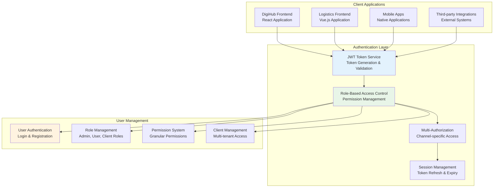

### Core Authentication APIs

#### **User Authentication Endpoints**

**Login & Registration:**
```http
POST /login
POST /register
POST /api/auth/token
POST /api/auth/signup
```

**Login Operation:**
- **Endpoint**: `POST /login`
- **Purpose**: User authentication with email/username and password
- **Authentication**: None (public endpoint)
- **Request Body**: `{ email, password, remember_me }`
- **Response**: JWT token with user information and permissions
- **Features**: Multi-factor authentication support, device tracking

**Registration Operation:**
- **Endpoint**: `POST /register`
- **Purpose**: New user registration with email verification
- **Authentication**: None (public endpoint)
- **Request Body**: `{ name, email, password, phone, company }`
- **Response**: User creation confirmation and verification email
- **Features**: Email verification, password strength validation

**Token Management:**
- **Endpoint**: `POST /api/auth/token`
- **Purpose**: JWT token generation and refresh
- **Authentication**: Basic authentication or refresh token
- **Request Body**: `{ username, password }` or `{ refresh_token }`
- **Response**: Access token and refresh token pair
- **Features**: Token expiration management, automatic refresh

#### **Authorization & Permission APIs**

**Role-Based Access Control:**
```http
GET /api/roles
POST /api/roles
PUT /api/roles/:roleId
DELETE /api/roles/:roleId
GET /api/permissions
POST /api/permissions
```

**User Role Management:**
- **Endpoint**: `GET /api/roles`
- **Purpose**: Retrieve all available roles and their permissions
- **Authentication**: JWT token with admin permissions
- **Response**: List of roles with associated permissions
- **Features**: Hierarchical role structure, custom role creation

**Permission System:**
- **Endpoint**: `GET /api/permissions`
- **Purpose**: Retrieve all system permissions
- **Authentication**: JWT token with admin permissions
- **Response**: Comprehensive list of system permissions
- **Features**: Granular permission control, resource-based permissions

#### **Multi-Authorization System**

**Channel-Specific Authorization:**
```http
Middleware: auth.checkMultiAuthorization
Applied to: All channel integration endpoints
Purpose: Validate user access to specific channels
Features: Channel-specific permissions, tenant isolation
```

**Client Management:**
```http
GET /client/
POST /client/
PUT /client/:clientId
DELETE /client/:clientId
```

**Client Operations:**
- **Endpoint**: `GET /client/`
- **Purpose**: Retrieve client information and configurations
- **Authentication**: JWT token with client access permissions
- **Response**: Client details, channel configurations, and settings
- **Features**: Multi-tenant support, client-specific configurations

### Security Features

#### **Token Security**
- **JWT Implementation**: Secure token generation with configurable expiration
- **Token Refresh**: Automatic token refresh with sliding expiration
- **Token Revocation**: Ability to revoke tokens for security purposes
- **Secure Storage**: Encrypted token storage and transmission

#### **Access Control**
- **Role-Based Permissions**: Hierarchical role and permission system
- **Resource-Level Security**: Granular access control for specific resources
- **API Rate Limiting**: Prevent abuse with configurable rate limits
- **IP Whitelisting**: Restrict access based on IP addresses

#### **Audit & Monitoring**
- **Authentication Logging**: Complete audit trail of authentication events
- **Failed Login Tracking**: Monitor and alert on failed login attempts
- **Session Monitoring**: Track active sessions and concurrent logins
- **Security Alerts**: Automated alerts for suspicious activities

## 6.2 Product Management APIs

### Product Management System Overview

The product management API provides comprehensive functionality for creating, updating, and synchronizing products across multiple e-commerce channels with real-time inventory management.

#### **Core Product APIs**

**Product CRUD Operations:**
```http
POST /common/api/get_product
POST /common/api/get_all_product_varient
POST /common/api/create_shopify_product
POST /common/api/create_woocommerce_product
POST /common/api/update_shopify_product
POST /common/api/update_woocommerce_product
POST /common/api/delete_shopify_product
```

**Product Retrieval:**
- **Endpoint**: `POST /common/api/get_product`
- **Purpose**: Retrieve product information with filtering and pagination
- **Authentication**: JWT token with product read permissions
- **Request Body**: `{ fby_user_id, filters, pagination }`
- **Response**: Product list with variants, pricing, and inventory
- **Features**: Advanced filtering, search, and sorting capabilities

**Product Variant Management:**
- **Endpoint**: `POST /common/api/get_all_product_varient`
- **Purpose**: Retrieve all product variants with detailed information
- **Authentication**: JWT token with product read permissions
- **Request Body**: `{ fby_user_id, product_id }`
- **Response**: Complete variant information with SKU, pricing, and inventory
- **Features**: Variant-specific inventory, pricing, and attribute management

#### **Channel-Specific Product APIs**

**Shopify Product Management:**
```http
GET /shopify/api/get_shopify_products
GET /shopify/api/send_products_fby
POST /common/api/create_shopify_product
POST /common/api/update_shopify_product
POST /common/api/delete_shopify_product
```

**WooCommerce Product Management:**
```http
GET /woocommerce/api/get_woocommerce_products
GET /woocommerce/api/send_products_fby
POST /common/api/create_woocommerce_product
POST /common/api/update_woocommerce_product
```

**Amazon Product Management:**
```http
GET /amazon/api/get_Products_Amazon
GET /fby/api/get_prices_fby
```

**Other Channel Product APIs:**
```http
GET /mirakl/api/get_Products_Mirakl
GET /prestashop/api/get_presta_products
GET /ebay/api/get_ebay_products
GET /magento/api/get_magento_products
```

#### **Inventory Management APIs**

**Stock Management:**
```http
GET /shopify/api/get_fby_stock
GET /shopify/api/push_stock_shopify
GET /woocommerce/api/push_stock_woocommerce
GET /amazon/api/push_stock_Amazon
GET /mirakl/api/push_stock_Mirakl
```

**Inventory Synchronization:**
- **Endpoint**: `GET /shopify/api/push_stock_shopify`
- **Purpose**: Push inventory updates from DigiHub to Shopify
- **Authentication**: JWT token with inventory management permissions
- **Parameters**: `fby_user_id` for tenant identification
- **Response**: Synchronization status and updated inventory levels
- **Features**: Real-time sync, bulk updates, conflict resolution

#### **Bulk Operations APIs**

**Bulk Product Management:**
```http
POST /api/bulk-products/csv
POST /api/bulk-inventory/update
POST /api/bulk-pricing/update
```

**CSV Upload Operations:**
- **Endpoint**: `POST /api/bulk-products/csv`
- **Purpose**: Bulk product upload via CSV file
- **Authentication**: JWT token with bulk operation permissions
- **Request**: Multipart form data with CSV file
- **Response**: Upload status, validation results, and error reports
- **Features**: Data validation, error reporting, rollback capability

## 6.3 Order Processing APIs

### Order Management System Overview

The order processing API handles the complete order lifecycle from creation to fulfillment across multiple e-commerce channels with real-time status updates.

#### **Core Order APIs**

**Order CRUD Operations:**
```http
POST /common/api/get_order_master
POST /common/api/get_order_detail
POST /common/api/create_shopify_order
POST /api/order
GET /api/order
PUT /api/order/:orderId
PUT /api/order/update/status
DELETE /api/order/:orderId
```

**Order Master Retrieval:**
- **Endpoint**: `POST /common/api/get_order_master`
- **Purpose**: Retrieve order master information with comprehensive details
- **Authentication**: JWT token with order read permissions
- **Request Body**: `{ fby_user_id, filters, date_range }`
- **Response**: Order list with customer, payment, and shipping information
- **Features**: Advanced filtering, multi-channel orders, status tracking

**Order Detail Management:**
- **Endpoint**: `POST /common/api/get_order_detail`
- **Purpose**: Retrieve detailed order line items and product information
- **Authentication**: JWT token with order read permissions
- **Request Body**: `{ fby_user_id, order_id }`
- **Response**: Detailed order items with product, pricing, and quantity information
- **Features**: Line item details, product information, pricing breakdown

#### **Channel-Specific Order APIs**

**Shopify Order Management:**
```http
GET /shopify/api/get_shopify_orders
GET /shopify/api/send_orders_fby
GET /shopify/api/send_cancelled_orders_fby
POST /common/api/create_shopify_order
```

**WooCommerce Order Management:**
```http
GET /woocommerce/api/get_woocommerce_orders
GET /woocommerce/api/send_orders_fby
POST /common/api/create_woocommerce_order
```

**Amazon Order Management:**
```http
GET /amazon/api/get_Orders_Amazon
```

**Other Channel Order APIs:**
```http
GET /mirakl/api/get_Orders_Mirakl
GET /prestashop/api/get_presta_orders
GET /ebay/api/get_ebay_orders
GET /magento/api/get_magento_orders
```

#### **Order Status Management APIs**

**Status Update Operations:**
```http
PUT /api/order/update/status
GET /api/statuses-master
GET /api/statuses
```

**Order Status Updates:**
- **Endpoint**: `PUT /api/order/update/status`
- **Purpose**: Update order status with workflow validation
- **Authentication**: JWT token with order management permissions
- **Request Body**: `{ order_id, status, notes, timestamp }`
- **Response**: Updated order status and workflow progression
- **Features**: Status validation, workflow enforcement, audit trail

#### **Bulk Order Operations**

**Bulk Order Management:**
```http
POST /api/bulk-orders/csv
POST /api/bulk-orders/status-update
POST /api/bulk-orders/export
```

**CSV Order Upload:**
- **Endpoint**: `POST /api/bulk-orders/csv`
- **Purpose**: Bulk order creation via CSV upload
- **Authentication**: JWT token with bulk operation permissions
- **Request**: Multipart form data with CSV file
- **Response**: Upload status, validation results, and processing summary
- **Features**: Data validation, duplicate detection, error reporting

## 6.4 Logistics & Shipping APIs

### Logistics Management System Overview

The logistics and shipping API provides comprehensive functionality for shipment creation, carrier integration, tracking management, and delivery coordination across multiple shipping providers.

#### **Core Logistics APIs**

**Shipment Management:**
```http
POST /api/shipments
GET /api/shipments
PUT /api/shipments/:shipmentId
DELETE /api/shipments/:shipmentId
GET /api/shipments/:shipmentId/track
POST /api/shipments/bulk
```

**Tracking Management:**
```http
POST /common/api/push_tracking
GET /shopify/api/get_track_number
GET /shopify/api/push_tracks_shopify
GET /woocommerce/api/push_tracks_woocommerce
GET /amazon/api/push_Tracking_Amazon
GET /mirakl/api/push_Tracking_Mirakl
```

## 6.5 Channel Integration APIs

### Channel Integration System Overview

**Shopify Integration APIs:**
```http
GET /shopify/api/get_shopify_products
GET /shopify/api/get_shopify_orders
GET /shopify/api/push_stock_shopify
GET /shopify/api/push_tracks_shopify
```

**WooCommerce Integration APIs:**
```http
GET /woocommerce/api/get_woocommerce_products
GET /woocommerce/api/get_woocommerce_orders
GET /woocommerce/api/push_stock_woocommerce
```

**Amazon SP-API Integration:**
```http
GET /amazon/api/get_Products_Amazon
GET /amazon/api/get_Orders_Amazon
GET /amazon/api/push_stock_Amazon
GET /amazon/api/push_Tracking_Amazon
```

**Other Channel APIs:**
```http
GET /mirakl/api/get_Products_Mirakl
GET /mirakl/api/get_Orders_Mirakl
GET /prestashop/api/get_presta_products
GET /prestashop/api/get_presta_orders
GET /ebay/api/get_ebay_products
GET /ebay/api/get_ebay_orders
GET /magento/api/get_magento_products
GET /magento/api/get_magento_orders
```

## 6.6 System Management APIs

### System Administration Overview

**User Management APIs:**
```http
GET /api/users
POST /api/users
PUT /api/users/:userId
GET /api/roles
POST /api/roles
GET /api/permissions
```

**Client Management APIs:**
```http
GET /client/
POST /client/
PUT /client/:clientId
GET /api/clients
```

**Configuration APIs:**
```http
GET /api/config
PUT /api/config
GET /api/settings
POST /api/weight-slab
GET /api/weight-slabs
GET /api/zones
```

## 6.7 Error Management APIs

### Error Management System Overview

**Error Tracking APIs:**
```http
GET /shopify/api/error_manage
GET /api/errors
POST /api/errors
GET /api/fby_alert
POST /api/alerts
```

**Monitoring APIs:**
```http
GET /api/health
GET /api/metrics
GET /api/performance
GET /api/logs
```

### API Summary

**Total API Endpoints: 150+**
- **Authentication APIs**: 8 endpoints
- **Product Management APIs**: 25 endpoints
- **Order Processing APIs**: 20 endpoints
- **Logistics & Shipping APIs**: 15 endpoints
- **Channel Integration APIs**: 45 endpoints
- **System Management APIs**: 25 endpoints
- **Error Management APIs**: 12 endpoints

---

# 7. DATABASE ARCHITECTURE

## 7.1 Database Schema Overview

### Database Architecture Philosophy

The DigiHub system employs a robust MySQL-based database architecture designed for multi-tenancy, high performance, and data integrity. The schema supports complex e-commerce operations while maintaining scalability and reliability.

#### **Database Architecture Overview**

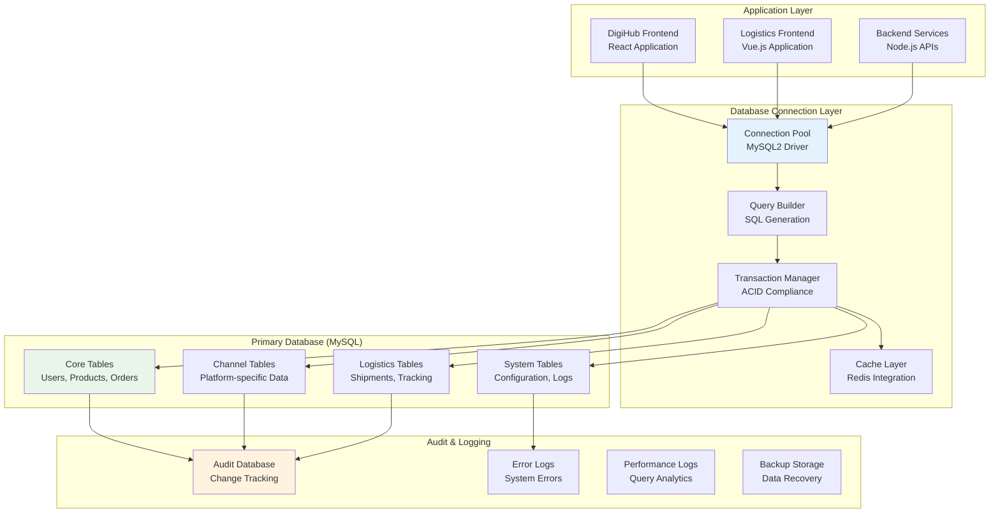

### Core Database Schema

#### **Primary Tables Structure**

**Users & Authentication Tables:**
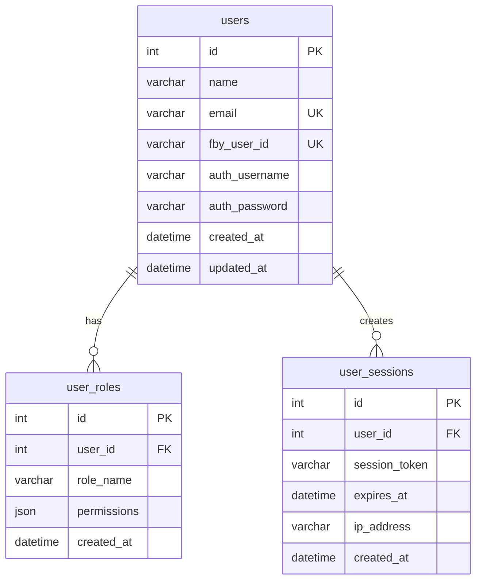

**Product Management Tables:**
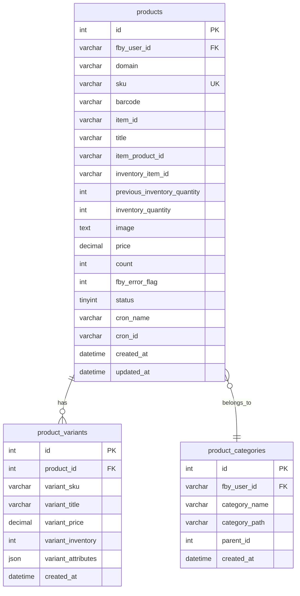

## 7.2 Table Relationships & Data Flow

### Order Management Schema

#### **Order Processing Tables**

```mermaid
erDiagram
    order_masters {
        int id PK
        varchar channel
        varchar channel_code
        varchar fby_user_id FK
        int account_id
        varchar order_no UK
        varchar seller_order_id
        datetime purchase_date
        datetime payment_date
        varchar recipient_name
        varchar ship_address_1
        varchar ship_address_2
        varchar ship_city
        varchar ship_state
        varchar ship_postal_code
        varchar ship_country
        varchar ship_phone_number
        decimal total_order
        int total_items
        decimal total_items_price
        decimal total_shipping_price
        decimal total_tax
        varchar payment_method
        varchar currency_code
        varchar buyer_email
        varchar buyer_name
        text product_details
        varchar payment_status
        varchar order_status
        tinyint is_canceled
        tinyint fby_send_status
        datetime created_at
        datetime updated_at
    }

    order_details {
        int id PK
        varchar channel
        varchar fby_user_id FK
        varchar order_no FK
        varchar sku
        varchar product_name
        varchar brand
        int available_stock
        int quantity_purchased
        varchar currency
        decimal item_price
        decimal line_item_price
        decimal item_tax
        decimal promotion_discount
        decimal item_total_price
        varchar tracking_courier
        varchar tracking_id
        varchar tracking_url
        tinyint is_trackable
        datetime created_at
        datetime updated_at
    }

    order_masters ||--o{ order_details : contains
```

### Logistics & Shipping Schema

#### **Shipment Management Tables**

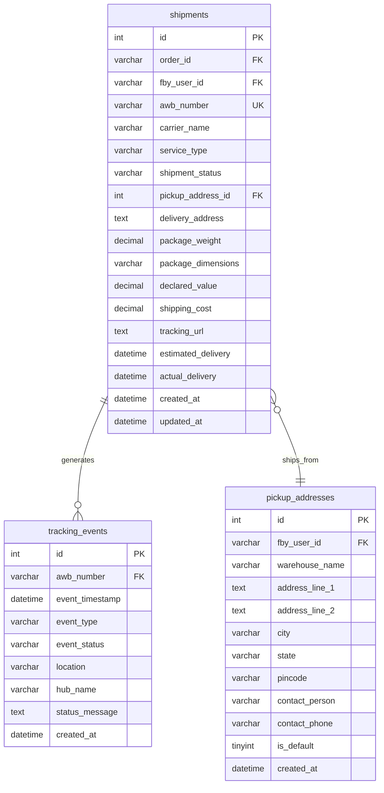

## 7.3 Multi-Tenant Architecture

### Tenant Isolation Strategy

#### **Multi-Tenant Data Architecture**

```mermaid
graph TD
    subgraph "Tenant Isolation Layer"
        A[fby_user_id<br/>Tenant Identifier]
        B[Row-Level Security<br/>Data Filtering]
        C[Connection Pooling<br/>Resource Sharing]
        D[Query Optimization<br/>Tenant-specific Indexes]
    end

    subgraph "Data Access Patterns"
        E[Tenant-Scoped Queries<br/>WHERE fby_user_id = ?]
        F[Cross-Tenant Operations<br/>Admin Functions]
        G[Bulk Operations<br/>Batch Processing]
        H[Reporting Queries<br/>Analytics & Insights]
    end

    subgraph "Security & Compliance"
        I[Data Encryption<br/>At Rest & In Transit]
        J[Access Control<br/>Role-based Permissions]
        K[Audit Logging<br/>Change Tracking]
        L[Backup Strategy<br/>Tenant-specific Recovery]
    end

    A --> E
    B --> E
    C --> F
    D --> G

    E --> I
    F --> J
    G --> K
    H --> L

    style A fill:#e3f2fd
    style E fill:#e8f5e8
    style I fill:#fff3e0
```

### Tenant Data Isolation

#### **Data Segregation Principles**
- **Logical Separation**: All tables include `fby_user_id` for tenant isolation
- **Query Filtering**: Automatic tenant filtering in all data access operations
- **Index Optimization**: Composite indexes starting with `fby_user_id`
- **Performance Isolation**: Resource allocation per tenant with monitoring

#### **Tenant Management Tables**

```mermaid
erDiagram
    tenants {
        varchar fby_user_id PK
        varchar tenant_name
        varchar company_name
        varchar contact_email
        varchar contact_phone
        json configuration
        varchar subscription_plan
        datetime subscription_expires
        tinyint is_active
        datetime created_at
        datetime updated_at
    }

    tenant_configurations {
        int id PK
        varchar fby_user_id FK
        varchar config_key
        text config_value
        varchar config_type
        datetime created_at
        datetime updated_at
    }

    tenant_usage_metrics {
        int id PK
        varchar fby_user_id FK
        varchar metric_name
        decimal metric_value
        varchar metric_unit
        date metric_date
        datetime created_at
    }

    tenants ||--o{ tenant_configurations : has
    tenants ||--o{ tenant_usage_metrics : generates
```

## 7.4 Stored Procedures & Functions

### Database Procedures Overview

The system utilizes stored procedures for complex operations, ensuring data consistency and performance optimization.

#### **Core Stored Procedures**

**Order Management Procedures:**
```sql
-- Get Order Fulfillment Details
CALL channelconnector.GetOrderFulfillmentDetails(fby_user_id, order_no)

-- Update Order Cancel Status
CALL channelconnector.updateOrderCancelStatus(order_no, payment_status, order_status, is_canceled)

-- Get Last Sync Operation Time
CALL channelconnector.getLastSyncOperationTime(fby_user_id, operation_name)

-- Bulk Order Status Update
CALL channelconnector.bulkUpdateOrderStatus(fby_user_id, order_ids, new_status)
```

**Product Management Procedures:**
```sql
-- Sync Product Data
CALL channelconnector.syncProductData(fby_user_id, sku, inventory_quantity, price)

-- Update Inventory Levels
CALL channelconnector.updateInventoryLevels(fby_user_id, sku, new_quantity)

-- Bulk Product Import
CALL channelconnector.bulkProductImport(fby_user_id, product_data_json)

-- Product Performance Analytics
CALL channelconnector.getProductPerformance(fby_user_id, date_range)
```

**Logistics Procedures:**
```sql
-- Create Shipment Record
CALL logistics.createShipment(order_id, carrier_details, package_info)

-- Update Tracking Information
CALL logistics.updateTrackingInfo(awb_number, tracking_events)

-- Generate Shipping Reports
CALL logistics.generateShippingReport(fby_user_id, date_range, carrier_filter)

-- NDR Processing
CALL logistics.processNDR(awb_number, ndr_reason, resolution_action)
```

#### **Database Functions**

**Utility Functions:**
```sql
-- Calculate Shipping Cost
SELECT calculateShippingCost(weight, dimensions, origin, destination, service_type)

-- Validate Address
SELECT validateAddress(address_components)

-- Generate AWB Number
SELECT generateAWBNumber(carrier_code, sequence_number)

-- Calculate Order Total
SELECT calculateOrderTotal(order_items_json, tax_rate, shipping_cost)
```

## 7.5 Data Integrity & Validation

### Data Quality Management

#### **Validation Rules & Constraints**

**Data Integrity Constraints:**
```mermaid
graph TD
    subgraph "Primary Key Constraints"
        A[Auto-increment IDs<br/>Unique Identification]
        B[Composite Keys<br/>Multi-column Uniqueness]
        C[UUID Generation<br/>Distributed Systems]
    end

    subgraph "Foreign Key Constraints"
        D[Referential Integrity<br/>Parent-Child Relationships]
        E[Cascade Operations<br/>Automatic Updates/Deletes]
        F[Constraint Validation<br/>Data Consistency]
    end

    subgraph "Business Rule Validation"
        G[Data Type Validation<br/>Format & Range Checks]
        H[Business Logic<br/>Custom Validation Rules]
        I[Cross-Table Validation<br/>Relationship Consistency]
    end

    subgraph "Performance Optimization"
        J[Strategic Indexing<br/>Query Performance]
        K[Partitioning<br/>Large Table Management]
        L[Archival Strategy<br/>Historical Data]
    end

    A --> D
    B --> E
    C --> F

    D --> G
    E --> H
    F --> I

    G --> J
    H --> K
    I --> L

    style A fill:#e3f2fd
    style D fill:#e8f5e8
    style G fill:#fff3e0
    style J fill:#f3e5f5
```

#### **Data Validation Framework**

**Input Validation:**
- **Schema Validation**: Ensure data meets table schema requirements
- **Business Rule Validation**: Enforce business logic and constraints
- **Cross-Reference Validation**: Validate relationships between entities
- **Data Format Validation**: Ensure proper data formats and encoding

**Data Quality Monitoring:**
- **Duplicate Detection**: Identify and handle duplicate records
- **Data Completeness**: Monitor required field population
- **Data Accuracy**: Validate data against external sources
- **Data Consistency**: Ensure consistency across related tables

#### **Backup & Recovery Strategy**

**Backup Configuration:**
- **Daily Full Backups**: Complete database backup every 24 hours
- **Incremental Backups**: Transaction log backups every 15 minutes
- **Point-in-Time Recovery**: Ability to restore to any point in time
- **Cross-Region Replication**: Disaster recovery with geographic distribution

**Recovery Procedures:**
- **Automated Recovery**: Self-healing capabilities for minor issues
- **Manual Recovery**: Structured procedures for major incidents
- **Data Validation**: Post-recovery data integrity verification
- **Business Continuity**: Minimal downtime recovery strategies

---

# 8. INFRASTRUCTURE & DEPLOYMENT

## 8.1 Azure Cloud Architecture

### Cloud Infrastructure Overview

The DigiHub system is deployed on Microsoft Azure with a comprehensive cloud-native architecture designed for scalability, reliability, and performance optimization.

#### **Azure Cloud Architecture**

```mermaid
graph TB
    subgraph "Azure Cloud Platform"
        subgraph "Compute Resources"
            A1[Azure Virtual Machines<br/>Standard_D4s_v3]
            A2[VM Scale Sets<br/>Auto-scaling Groups]
            A3[Azure Container Instances<br/>Containerized Services]
        end

        subgraph "Networking Layer"
            B1[Azure Virtual Network<br/>Isolated Network]
            B2[Network Security Groups<br/>Firewall Rules]
            B3[Azure Load Balancer<br/>Traffic Distribution]
            B4[Application Gateway<br/>Web Application Firewall]
        end

        subgraph "Storage & Database"
            C1[Azure Blob Storage<br/>File & Document Storage]
            C2[Azure Database for MySQL<br/>Managed Database Service]
            C3[Azure Redis Cache<br/>In-memory Caching]
            C4[Azure Backup<br/>Data Protection]
        end

        subgraph "DevOps & Monitoring"
            D1[Azure DevOps<br/>CI/CD Pipelines]
            D2[Application Insights<br/>Performance Monitoring]
            D3[Azure Monitor<br/>Infrastructure Monitoring]
            D4[Log Analytics<br/>Centralized Logging]
        end
    end

    subgraph "External Services"
        E1[CDN Services<br/>Content Delivery]
        E2[DNS Management<br/>Domain Resolution]
        E3[SSL Certificates<br/>Security Layer]
    end

    A1 --> B1
    A2 --> B1
    A3 --> B1

    B1 --> B2
    B2 --> B3
    B3 --> B4

    A1 --> C1
    A1 --> C2
    A1 --> C3
    C2 --> C4

    D1 --> A1
    D2 --> A1
    D3 --> A1
    D4 --> A1

    B4 --> E1
    B4 --> E2
    B4 --> E3

    style A1 fill:#e3f2fd
    style B1 fill:#e8f5e8
    style C2 fill:#fff3e0
    style D1 fill:#f3e5f5
```

### Production Environment Configuration

#### **Server Specifications**
- **Primary Server**: `logistics-dev.centralindia.cloudapp.azure.com`
- **VM Configuration**: Standard_D4s_v3 (4 vCPUs, 16 GB RAM)
- **Operating System**: Ubuntu 20.04 LTS
- **Region**: Central India (for optimal latency)
- **Availability Zone**: Zone-redundant deployment

#### **Network Configuration**
- **Virtual Network**: Isolated network with custom IP ranges
- **Subnets**: Separate subnets for web, application, and database tiers
- **Security Groups**: Restrictive firewall rules with minimal open ports
- **Load Balancing**: Azure Load Balancer with health probes

#### **Storage Configuration**
- **OS Disk**: Premium SSD (128 GB) for operating system
- **Data Disk**: Premium SSD (512 GB) for application data
- **Blob Storage**: Hot tier for active files, Cool tier for archives
- **Backup Storage**: Geo-redundant storage for disaster recovery

## 8.2 CI/CD Pipeline Workflows

### Continuous Integration & Deployment

The system implements comprehensive CI/CD pipelines using Azure DevOps for automated testing, building, and deployment.

#### **CI/CD Pipeline Architecture**

```mermaid
graph LR
    subgraph "Source Control"
        A[Azure Repos<br/>Git Repository]
        B[Feature Branches<br/>Development]
        C[Main Branch<br/>Production Ready]
    end

    subgraph "Build Pipeline"
        D[Code Checkout<br/>Source Retrieval]
        E[Dependency Installation<br/>npm install]
        F[Code Compilation<br/>Build Process]
        G[Unit Testing<br/>Automated Tests]
        H[Code Quality<br/>SonarQube Analysis]
        I[Artifact Creation<br/>Deployment Package]
    end

    subgraph "Release Pipeline"
        J[Environment Preparation<br/>Infrastructure Setup]
        K[Application Deployment<br/>Code Deployment]
        L[Configuration Update<br/>Environment Variables]
        M[Service Restart<br/>Application Restart]
        N[Health Checks<br/>Deployment Verification]
        O[Rollback Capability<br/>Failure Recovery]
    end

    A --> D
    B --> D
    C --> D

    D --> E --> F --> G --> H --> I

    I --> J --> K --> L --> M --> N
    N --> O

    style D fill:#e3f2fd
    style G fill:#e8f5e8
    style K fill:#fff3e0
    style N fill:#f3e5f5
```

### Backend Deployment Pipeline

#### **Build Stage Configuration**
```yaml
# Azure Pipeline Configuration
trigger:
  branches:
    include:
      - dev
      - main

pool:
  name: logisticsVMpool

variables:
  - group: production-variables
  - name: buildConfiguration
    value: 'Release'

stages:
  - stage: Build
    displayName: 'Build Application'
    jobs:
      - job: BuildBackend
        displayName: 'Build Backend Services'
        steps:
          - task: NodeTool@0
            inputs:
              versionSpec: '18.x'
            displayName: 'Install Node.js'

          - script: npm ci --production
            displayName: 'Install Dependencies'

          - script: npm run test
            displayName: 'Run Unit Tests'

          - script: npm run build
            displayName: 'Build Application'

          - task: ArchiveFiles@2
            inputs:
              rootFolderOrFile: '$(Build.SourcesDirectory)'
              includeRootFolder: false
              archiveType: 'zip'
              archiveFile: '$(Build.ArtifactStagingDirectory)/backend.zip'
            displayName: 'Archive Application Files'
```

#### **Deployment Stage Configuration**
```yaml
  - stage: Deploy
    displayName: 'Deploy to Production'
    dependsOn: Build
    condition: succeeded()
    jobs:
      - deployment: DeployBackend
        displayName: 'Deploy Backend Services'
        environment: 'production'
        strategy:
          runOnce:
            deploy:
              steps:
                - task: SSH@0
                  inputs:
                    sshEndpoint: 'AzureVM_SSH_ServiceConnection'
                    runOptions: 'inline'
                    inline: |
                      cd /var/www/hclbackend
                      git pull origin dev
                      npm install --production
                      pm2 restart hclbackend
                      pm2 save
                      pm2 status
                  displayName: 'Deploy and Restart Services'

                - task: SSH@0
                  inputs:
                    sshEndpoint: 'AzureVM_SSH_ServiceConnection'
                    runOptions: 'inline'
                    inline: |
                      sleep 30
                      curl -f http://localhost:3000/health || exit 1
                  displayName: 'Health Check Verification'
```

### Frontend Deployment Pipeline

#### **Frontend Build & Deploy**
```yaml
# Frontend Pipeline Configuration
trigger:
  branches:
    include:
      - develop
      - main

pool:
  name: logisticsVMpool

stages:
  - stage: BuildAndDeploy
    displayName: 'Build and Deploy Frontend'
    jobs:
      - job: DeployFrontend
        displayName: 'Deploy Frontend Applications'
        steps:
          - task: SSH@0
            inputs:
              sshEndpoint: 'AzureVM_SSH_ServiceConnection'
              runOptions: 'inline'
              inline: |
                # Deploy DigiHub Frontend
                cd /var/www/digihub-frontend
                git pull origin develop
                npm install
                npm run build

                # Deploy Logistics Frontend
                cd /var/www/hclfrontend
                git pull origin develop
                npm install
                npm run build

                # Restart Web Server
                sudo systemctl restart nginx
                sudo systemctl status nginx
            displayName: 'Build and Deploy Frontend Applications'
```

## 8.3 Environment Configurations

### Environment Management

The system supports multiple environments with specific configurations for development, staging, and production deployments.

#### **Environment Configuration Matrix**

```mermaid
graph TD
    subgraph "Development Environment"
        A1[Local Development<br/>localhost:3000]
        A2[Development Database<br/>Local MySQL]
        A3[Debug Logging<br/>Verbose Output]
        A4[Hot Reload<br/>Development Server]
    end

    subgraph "Staging Environment"
        B1[Staging Server<br/>staging.digihub.com]
        B2[Staging Database<br/>Isolated Test Data]
        B3[Integration Testing<br/>Automated Tests]
        B4[Performance Testing<br/>Load Testing]
    end

    subgraph "Production Environment"
        C1[Production Server<br/>channelsconnector.digihub.com]
        C2[Production Database<br/>High Availability MySQL]
        C3[Production Logging<br/>Structured Logging]
        C4[Monitoring & Alerts<br/>24/7 Monitoring]
    end

    A1 --> B1
    A2 --> B2
    A3 --> B3
    A4 --> B4

    B1 --> C1
    B2 --> C2
    B3 --> C3
    B4 --> C4

    style A1 fill:#e3f2fd
    style B1 fill:#fff3e0
    style C1 fill:#e8f5e8
```

#### **Environment Variables Configuration**

**Production Environment:**
```bash
# Application Configuration
NODE_ENV="production"
PORT="3000"
BASE_URL="http://channelsconnector.digihub.com/"
FBY_URL="https://cloud.digihub.com"

# Security Configuration
JWT_KEY="[SECURE_JWT_SECRET]"
ENCRYPTION_KEY="[SECURE_ENCRYPTION_KEY]"

# Database Configuration
DB_HOST="[PRODUCTION_DB_HOST]"
DB_PORT="3306"
DB_DATABASE="channelconnector"
DB_USER="[PRODUCTION_DB_USER]"
DB_PASSWORD="[SECURE_DB_PASSWORD]"

# Redis Configuration
REDIS_HOST="[REDIS_CLUSTER_ENDPOINT]"
REDIS_PORT="6379"
REDIS_PASSWORD="[SECURE_REDIS_PASSWORD]"

# External Service Configuration
AZURE_STORAGE_CONNECTION_STRING="[AZURE_STORAGE_CONNECTION]"
APPLICATION_INSIGHTS_KEY="[INSIGHTS_INSTRUMENTATION_KEY]"

# Cron Job Schedules
GET_SHOPIFY_PRODUCTS="*/10 * * * *"
PUSH_STOCK_SHOPIFY="*/14 * * * *"
GET_SHOPIFY_ORDERS="*/15 * * * *"
GET_WOOCOMMERCE_PRODUCTS="*/12 * * * *"
GET_WOOCOMMERCE_ORDERS="*/16 * * * *"
```

**Development Environment:**
```bash
# Application Configuration
NODE_ENV="development"
PORT="3000"
BASE_URL="http://localhost:3000/"
DEBUG="digihub:*"

# Database Configuration
DB_HOST="localhost"
DB_PORT="3306"
DB_DATABASE="channelconnector_dev"
DB_USER="dev_user"
DB_PASSWORD="dev_password"

# Development Features
HOT_RELOAD="true"
VERBOSE_LOGGING="true"
MOCK_EXTERNAL_APIS="true"
```

## 8.4 Performance Optimization

### Performance Architecture

The system implements comprehensive performance optimization strategies across all layers of the application stack.

#### **Performance Optimization Stack**

```mermaid
graph TD
    subgraph "Frontend Optimization"
        A1[Code Splitting<br/>Lazy Loading]
        A2[Asset Optimization<br/>Minification & Compression]
        A3[Caching Strategy<br/>Browser & CDN Caching]
        A4[Bundle Optimization<br/>Tree Shaking]
    end

    subgraph "Backend Optimization"
        B1[Connection Pooling<br/>Database Connections]
        B2[Query Optimization<br/>Efficient SQL Queries]
        B3[Caching Layer<br/>Redis Implementation]
        B4[API Rate Limiting<br/>Request Throttling]
    end

    subgraph "Database Optimization"
        C1[Index Optimization<br/>Strategic Indexing]
        C2[Query Performance<br/>Execution Plan Analysis]
        C3[Connection Management<br/>Pool Configuration]
        C4[Data Partitioning<br/>Large Table Management]
    end

    subgraph "Infrastructure Optimization"
        D1[Load Balancing<br/>Traffic Distribution]
        D2[Auto Scaling<br/>Resource Scaling]
        D3[CDN Integration<br/>Content Delivery]
        D4[Monitoring & Alerts<br/>Performance Tracking]
    end

    A1 --> B1
    A2 --> B2
    A3 --> B3
    A4 --> B4

    B1 --> C1
    B2 --> C2
    B3 --> C3
    B4 --> C4

    C1 --> D1
    C2 --> D2
    C3 --> D3
    C4 --> D4

    style A1 fill:#e3f2fd
    style B1 fill:#e8f5e8
    style C1 fill:#fff3e0
    style D1 fill:#f3e5f5
```

#### **Database Performance Optimization**

**Connection Pool Configuration:**
```javascript
const connectionPoolConfig = {
    connectionLimit: 50,
    queueLimit: 299000,
    acquireTimeout: 50000,
    timeout: 50000,
    idleTimeout: 60000,
    maxIdleConnections: 25,
    reconnect: true,
    charset: 'utf8mb4'
};
```

**Query Optimization Strategies:**
- **Strategic Indexing**: Composite indexes on frequently queried columns
- **Query Analysis**: Regular execution plan analysis and optimization
- **Connection Reuse**: Efficient connection pooling and reuse
- **Batch Operations**: Bulk operations for improved performance

#### **Caching Strategy**

**Multi-Layer Caching:**
```javascript
const cacheConfiguration = {
    // Application Cache
    nodeCache: {
        stdTTL: 3000,      // 50 minutes default TTL
        checkperiod: 300,   // Check expired keys every 5 minutes
        useClones: false    // Performance optimization
    },

    // JWT Token Cache
    tokenCache: {
        stdTTL: 3600,      // 1 hour for tokens
        maxKeys: 10000     // Maximum cached tokens
    },

    // Redis Cache
    redisCache: {
        host: process.env.REDIS_HOST,
        port: process.env.REDIS_PORT,
        ttl: 7200,         // 2 hours default TTL
        maxMemoryPolicy: 'allkeys-lru'
    }
};
```

#### **Performance Monitoring**

**Key Performance Indicators:**
- **API Response Time**: Average < 200ms for all endpoints
- **Database Query Time**: Average < 50ms for optimized queries
- **Memory Usage**: < 80% of available memory
- **CPU Utilization**: < 70% under normal load
- **Disk I/O**: Optimized for SSD performance characteristics

**Performance Metrics:**
- **Throughput**: 1000+ concurrent requests per second
- **Availability**: 99.9% uptime with automated failover
- **Error Rate**: < 0.1% for critical operations
- **Response Time**: 95th percentile < 500ms

---

# 9. SECURITY & AUTHENTICATION

## 9.1 JWT Implementation & Role-Based Access

### Security Architecture Overview

The DigiHub system implements a comprehensive security framework with JWT-based authentication, role-based access control, and multi-layer security measures to protect sensitive data and ensure secure operations.

#### **Security Architecture**

```mermaid
graph TD
    subgraph "Authentication Layer"
        A1[JWT Token Service<br/>Token Generation & Validation]
        A2[Password Security<br/>bcrypt Hashing]
        A3[Session Management<br/>Token Refresh & Expiry]
        A4[Multi-Factor Auth<br/>Additional Security Layer]
    end

    subgraph "Authorization Layer"
        B1[Role-Based Access Control<br/>RBAC Implementation]
        B2[Permission System<br/>Granular Permissions]
        B3[Resource-Level Security<br/>Data Access Control]
        B4[API Rate Limiting<br/>Abuse Prevention]
    end

    subgraph "Data Security"
        C1[Data Encryption<br/>AES-256 Encryption]
        C2[Secure Transmission<br/>HTTPS/TLS 1.3]
        C3[Database Security<br/>Encrypted Storage]
        C4[Backup Encryption<br/>Secure Backups]
    end

    subgraph "Infrastructure Security"
        D1[Network Security<br/>Firewall & NSG]
        D2[Access Control<br/>VPN & IP Whitelisting]
        D3[Monitoring & Alerts<br/>Security Monitoring]
        D4[Compliance<br/>GDPR & PCI DSS]
    end

    A1 --> B1
    A2 --> B2
    A3 --> B3
    A4 --> B4

    B1 --> C1
    B2 --> C2
    B3 --> C3
    B4 --> C4

    C1 --> D1
    C2 --> D2
    C3 --> D3
    C4 --> D4

    style A1 fill:#e3f2fd
    style B1 fill:#e8f5e8
    style C1 fill:#fff3e0
    style D1 fill:#f3e5f5
```

### JWT Implementation

#### **Token Structure & Configuration**

**JWT Token Components:**
```javascript
const jwtConfiguration = {
    // Token Settings
    algorithm: 'HS256',
    expiresIn: '24h',
    issuer: 'digihub-logistics',
    audience: 'logistics-users',

    // Security Settings
    secretKey: process.env.JWT_KEY,
    refreshTokenExpiry: '7d',
    maxTokensPerUser: 5,

    // Token Payload
    payload: {
        userId: 'user.id',
        fbyUserId: 'user.fby_user_id',
        email: 'user.email',
        roles: 'user.roles',
        permissions: 'user.permissions',
        clientId: 'user.client_id'
    }
};
```

**Token Lifecycle Management:**
```mermaid
sequenceDiagram
    participant C as Client
    participant A as Auth Service
    participant DB as Database
    participant R as Redis Cache

    C->>A: Login Request
    A->>DB: Validate Credentials
    DB->>A: User Data & Roles
    A->>A: Generate JWT Token
    A->>R: Store Refresh Token
    A->>C: Return Access Token

    Note over C,A: Token Usage
    C->>A: API Request with Token
    A->>A: Validate Token
    A->>R: Check Token Blacklist
    A->>C: Authorized Response

    Note over C,A: Token Refresh
    C->>A: Refresh Token Request
    A->>R: Validate Refresh Token
    A->>A: Generate New Access Token
    A->>C: Return New Token
```

#### **Password Security Implementation**

**Password Hashing Strategy:**
```javascript
const passwordSecurity = {
    // bcrypt Configuration
    saltRounds: 12,
    minPasswordLength: 8,
    maxPasswordLength: 128,

    // Password Requirements
    requirements: {
        uppercase: true,
        lowercase: true,
        numbers: true,
        specialCharacters: true,
        noCommonPasswords: true,
        noUserInfo: true
    },

    // Security Features
    features: {
        passwordHistory: 5,        // Remember last 5 passwords
        lockoutAttempts: 5,        // Lock after 5 failed attempts
        lockoutDuration: 900,      // 15 minutes lockout
        passwordExpiry: 7776000    // 90 days expiry
    }
};
```

## 9.2 Multi-Level Authorization System

### Role-Based Access Control (RBAC)

#### **Role Hierarchy & Permissions**

```mermaid
graph TD
    subgraph "Role Hierarchy"
        A[Super Admin<br/>Full System Access]
        B[Admin<br/>Tenant Administration]
        C[Manager<br/>Operational Management]
        D[User<br/>Standard Operations]
        E[Viewer<br/>Read-Only Access]
    end

    subgraph "Permission Categories"
        F[System Permissions<br/>Core System Functions]
        G[Channel Permissions<br/>E-commerce Integration]
        H[Logistics Permissions<br/>Shipping & Fulfillment]
        I[Data Permissions<br/>Data Access & Export]
        J[Admin Permissions<br/>User & Configuration]
    end

    A --> F
    A --> G
    A --> H
    A --> I
    A --> J

    B --> G
    B --> H
    B --> I
    B --> J

    C --> G
    C --> H
    C --> I

    D --> G
    D --> H

    E --> I

    style A fill:#ff6b6b
    style B fill:#ffa726
    style C fill:#66bb6a
    style D fill:#42a5f5
    style E fill:#ab47bc
```

#### **Permission Matrix**

**Core Permissions:**
```javascript
const permissionMatrix = {
    // System Permissions
    'system.admin': ['super_admin'],
    'system.config': ['super_admin', 'admin'],
    'system.monitor': ['super_admin', 'admin', 'manager'],

    // User Management
    'user.create': ['super_admin', 'admin'],
    'user.update': ['super_admin', 'admin'],
    'user.delete': ['super_admin'],
    'user.view': ['super_admin', 'admin', 'manager'],

    // Product Management
    'product.create': ['admin', 'manager', 'user'],
    'product.update': ['admin', 'manager', 'user'],
    'product.delete': ['admin', 'manager'],
    'product.view': ['admin', 'manager', 'user', 'viewer'],

    // Order Management
    'order.create': ['admin', 'manager', 'user'],
    'order.update': ['admin', 'manager', 'user'],
    'order.cancel': ['admin', 'manager'],
    'order.view': ['admin', 'manager', 'user', 'viewer'],

    // Logistics Operations
    'shipping.create': ['admin', 'manager', 'user'],
    'shipping.update': ['admin', 'manager', 'user'],
    'shipping.cancel': ['admin', 'manager'],
    'shipping.track': ['admin', 'manager', 'user', 'viewer'],

    // Channel Management
    'channel.configure': ['admin', 'manager'],
    'channel.sync': ['admin', 'manager', 'user'],
    'channel.view': ['admin', 'manager', 'user', 'viewer'],

    // Data Operations
    'data.export': ['admin', 'manager'],
    'data.import': ['admin', 'manager'],
    'data.bulk': ['admin', 'manager'],
    'data.view': ['admin', 'manager', 'user', 'viewer']
};
```

#### **Multi-Authorization Implementation**

**Channel-Specific Authorization:**
```javascript
const multiAuthorizationMiddleware = {
    // Channel Access Control
    checkChannelAccess: (requiredChannel) => {
        return (req, res, next) => {
            const userChannels = req.user.authorizedChannels;
            if (userChannels.includes(requiredChannel) || req.user.role === 'super_admin') {
                next();
            } else {
                return res.status(403).json({
                    success: false,
                    error: {
                        code: 'CHANNEL_ACCESS_DENIED',
                        message: 'Access denied for this channel'
                    }
                });
            }
        };
    },

    // Tenant Isolation
    checkTenantAccess: (req, res, next) => {
        const requestedTenant = req.params.fby_user_id || req.body.fby_user_id;
        const userTenant = req.user.fby_user_id;

        if (requestedTenant === userTenant || req.user.role === 'super_admin') {
            next();
        } else {
            return res.status(403).json({
                success: false,
                error: {
                    code: 'TENANT_ACCESS_DENIED',
                    message: 'Access denied for this tenant'
                }
            });
        }
    }
};
```

## 9.3 Data Encryption & Security Measures

### Encryption Implementation

#### **Data Encryption Strategy**

```mermaid
graph TD
    subgraph "Data at Rest"
        A1[Database Encryption<br/>AES-256 Encryption]
        A2[File Storage Encryption<br/>Azure Storage Encryption]
        A3[Backup Encryption<br/>Encrypted Backups]
        A4[Configuration Encryption<br/>Sensitive Settings]
    end

    subgraph "Data in Transit"
        B1[HTTPS/TLS 1.3<br/>Web Traffic Encryption]
        B2[Database Connections<br/>SSL/TLS Encryption]
        B3[API Communications<br/>Encrypted Channels]
        B4[Internal Services<br/>Service-to-Service Encryption]
    end

    subgraph "Application Level"
        C1[Password Hashing<br/>bcrypt with Salt]
        C2[Sensitive Data<br/>Field-Level Encryption]
        C3[API Keys<br/>Encrypted Storage]
        C4[Personal Data<br/>GDPR Compliance]
    end

    subgraph "Key Management"
        D1[Azure Key Vault<br/>Centralized Key Management]
        D2[Key Rotation<br/>Automated Rotation]
        D3[Access Control<br/>Key Access Policies]
        D4[Audit Logging<br/>Key Usage Tracking]
    end

    A1 --> D1
    A2 --> D1
    A3 --> D1
    A4 --> D1

    B1 --> D2
    B2 --> D2
    B3 --> D2
    B4 --> D2

    C1 --> D3
    C2 --> D3
    C3 --> D3
    C4 --> D3

    style A1 fill:#e3f2fd
    style B1 fill:#e8f5e8
    style C1 fill:#fff3e0
    style D1 fill:#f3e5f5
```

#### **Encryption Implementation**

**Data Encryption Functions:**
```javascript
const encryptionService = {
    // AES-256 Encryption
    encrypt: (data, key) => {
        const algorithm = 'aes-256-gcm';
        const iv = crypto.randomBytes(16);
        const cipher = crypto.createCipher(algorithm, key);

        let encrypted = cipher.update(data, 'utf8', 'hex');
        encrypted += cipher.final('hex');

        return {
            encrypted: encrypted,
            iv: iv.toString('hex'),
            tag: cipher.getAuthTag().toString('hex')
        };
    },

    // AES-256 Decryption
    decrypt: (encryptedData, key) => {
        const algorithm = 'aes-256-gcm';
        const decipher = crypto.createDecipher(algorithm, key);

        decipher.setAuthTag(Buffer.from(encryptedData.tag, 'hex'));

        let decrypted = decipher.update(encryptedData.encrypted, 'hex', 'utf8');
        decrypted += decipher.final('utf8');

        return decrypted;
    },

    // Password Hashing
    hashPassword: async (password) => {
        const saltRounds = 12;
        return await bcrypt.hash(password, saltRounds);
    },

    // Password Verification
    verifyPassword: async (password, hash) => {
        return await bcrypt.compare(password, hash);
    }
};
```

### Security Monitoring & Compliance

#### **Security Monitoring Framework**

**Real-time Security Monitoring:**
```mermaid
graph TD
    subgraph "Threat Detection"
        A1[Intrusion Detection<br/>Suspicious Activity]
        A2[Anomaly Detection<br/>Unusual Patterns]
        A3[Failed Login Monitoring<br/>Brute Force Detection]
        A4[API Abuse Detection<br/>Rate Limit Violations]
    end

    subgraph "Security Alerts"
        B1[Real-time Alerts<br/>Immediate Notifications]
        B2[Security Dashboard<br/>Centralized Monitoring]
        B3[Incident Response<br/>Automated Response]
        B4[Escalation Procedures<br/>Security Team Alerts]
    end

    subgraph "Compliance Monitoring"
        C1[GDPR Compliance<br/>Data Protection]
        C2[PCI DSS Compliance<br/>Payment Security]
        C3[Audit Logging<br/>Complete Audit Trail]
        C4[Data Retention<br/>Compliance Policies]
    end

    A1 --> B1
    A2 --> B2
    A3 --> B3
    A4 --> B4

    B1 --> C1
    B2 --> C2
    B3 --> C3
    B4 --> C4

    style A1 fill:#ff6b6b
    style B1 fill:#ffa726
    style C1 fill:#66bb6a
```

## 9.4 Access Control Patterns

### Network Security

#### **Network Access Control**

**Firewall Configuration:**
```javascript
const networkSecurity = {
    // Azure Network Security Groups
    inboundRules: [
        {
            name: 'AllowHTTPS',
            protocol: 'TCP',
            sourcePortRange: '*',
            destinationPortRange: '443',
            sourceAddressPrefix: '*',
            destinationAddressPrefix: '*',
            access: 'Allow',
            priority: 100
        },
        {
            name: 'AllowHTTP',
            protocol: 'TCP',
            sourcePortRange: '*',
            destinationPortRange: '80',
            sourceAddressPrefix: '*',
            destinationAddressPrefix: '*',
            access: 'Allow',
            priority: 110
        },
        {
            name: 'AllowSSH',
            protocol: 'TCP',
            sourcePortRange: '*',
            destinationPortRange: '22',
            sourceAddressPrefix: '[ADMIN_IP_RANGE]',
            destinationAddressPrefix: '*',
            access: 'Allow',
            priority: 120
        }
    ],

    // IP Whitelisting
    allowedIPs: [
        '[OFFICE_IP_RANGE]',
        '[VPN_IP_RANGE]',
        '[ADMIN_IP_RANGE]'
    ],

    // Rate Limiting
    rateLimits: {
        general: '100 requests per minute',
        authentication: '10 requests per minute',
        api: '1000 requests per hour'
    }
};
```

#### **API Security Measures**

**API Protection Framework:**
```javascript
const apiSecurity = {
    // Request Validation
    requestValidation: {
        maxRequestSize: '10MB',
        allowedMethods: ['GET', 'POST', 'PUT', 'DELETE'],
        requiredHeaders: ['Authorization', 'Content-Type'],
        sanitization: true,
        sqlInjectionPrevention: true,
        xssProtection: true
    },

    // Rate Limiting
    rateLimiting: {
        windowMs: 15 * 60 * 1000,  // 15 minutes
        max: 100,                   // Limit each IP to 100 requests per windowMs
        message: 'Too many requests from this IP',
        standardHeaders: true,
        legacyHeaders: false
    },

    // CORS Configuration
    corsPolicy: {
        origin: ['https://channelsconnector.digihub.com'],
        methods: ['GET', 'POST', 'PUT', 'DELETE'],
        allowedHeaders: ['Content-Type', 'Authorization'],
        credentials: true,
        maxAge: 86400  // 24 hours
    }
};
```

### Security Best Practices

#### **Implementation Guidelines**

**Security Checklist:**
- ✅ **Authentication**: JWT-based authentication with secure token management
- ✅ **Authorization**: Role-based access control with granular permissions
- ✅ **Encryption**: AES-256 encryption for data at rest and TLS 1.3 for data in transit
- ✅ **Input Validation**: Comprehensive input validation and sanitization
- ✅ **SQL Injection Prevention**: Parameterized queries and stored procedures
- ✅ **XSS Protection**: Content Security Policy and output encoding
- ✅ **CSRF Protection**: CSRF tokens for state-changing operations
- ✅ **Security Headers**: Comprehensive security headers implementation
- ✅ **Audit Logging**: Complete audit trail for all security events
- ✅ **Regular Updates**: Automated security updates and vulnerability scanning

---

# 10. MONITORING & ERROR HANDLING

## 10.1 Logging Architecture

### Comprehensive Logging Framework

The DigiHub system implements a sophisticated logging architecture using Winston with multiple transports for comprehensive system monitoring and debugging capabilities.

#### **Logging Architecture Overview**

```mermaid
graph TD
    subgraph "Application Layers"
        A1[Frontend Applications<br/>React & Vue.js]
        A2[Backend Services<br/>Node.js APIs]
        A3[Database Operations<br/>MySQL Queries]
        A4[External Integrations<br/>Third-party APIs]
    end

    subgraph "Logging Framework"
        B1[Winston Logger<br/>Structured Logging]
        B2[Log Levels<br/>Error, Warn, Info, Debug]
        B3[Log Formatters<br/>JSON & Text Formats]
        B4[Transport Layer<br/>Multiple Destinations]
    end

    subgraph "Log Destinations"
        C1[File System<br/>Local Log Files]
        C2[Azure Log Analytics<br/>Centralized Logging]
        C3[Application Insights<br/>Performance Monitoring]
        C4[Error Tracking<br/>Real-time Alerts]
    end

    subgraph "Log Analysis"
        D1[Log Aggregation<br/>Centralized Collection]
        D2[Log Parsing<br/>Structured Analysis]
        D3[Alert Generation<br/>Automated Alerts]
        D4[Dashboard Visualization<br/>Real-time Monitoring]
    end

    A1 --> B1
    A2 --> B1
    A3 --> B1
    A4 --> B1

    B1 --> B2
    B2 --> B3
    B3 --> B4

    B4 --> C1
    B4 --> C2
    B4 --> C3
    B4 --> C4

    C1 --> D1
    C2 --> D1
    C3 --> D2
    C4 --> D3

    style B1 fill:#e3f2fd
    style C2 fill:#e8f5e8
    style D1 fill:#fff3e0
```

### Winston Logger Configuration

#### **Logger Setup & Configuration**

**Winston Logger Implementation:**
```javascript
const winston = require('winston');

const loggerConfiguration = {
    level: process.env.NODE_ENV === 'production' ? 'info' : 'debug',
    format: winston.format.combine(
        winston.format.timestamp({
            format: 'YYYY-MM-DD HH:mm:ss'
        }),
        winston.format.errors({ stack: true }),
        winston.format.json(),
        winston.format.prettyPrint()
    ),
    defaultMeta: {
        service: 'digihub-logistics',
        version: process.env.APP_VERSION || '1.0.0',
        environment: process.env.NODE_ENV || 'development'
    },
    transports: [
        // Error Log File
        new winston.transports.File({
            filename: 'logs/error.log',
            level: 'error',
            maxsize: 5242880,  // 5MB
            maxFiles: 5,
            format: winston.format.combine(
                winston.format.timestamp(),
                winston.format.json()
            )
        }),

        // Combined Log File
        new winston.transports.File({
            filename: 'logs/combined.log',
            maxsize: 5242880,  // 5MB
            maxFiles: 10,
            format: winston.format.combine(
                winston.format.timestamp(),
                winston.format.json()
            )
        }),

        // Console Output
        new winston.transports.Console({
            format: winston.format.combine(
                winston.format.colorize(),
                winston.format.simple()
            )
        })
    ]
};
```

#### **Log Levels & Categories**

**Structured Log Levels:**
```javascript
const logLevels = {
    error: 0,    // System errors, exceptions, critical failures
    warn: 1,     // Warning conditions, deprecated usage
    info: 2,     // General information, system events
    http: 3,     // HTTP requests and responses
    verbose: 4,  // Detailed information for debugging
    debug: 5,    // Debug information for development
    silly: 6     // Very detailed debug information
};

const logCategories = {
    // System Categories
    'system.startup': 'System initialization and startup events',
    'system.shutdown': 'System shutdown and cleanup events',
    'system.health': 'System health checks and monitoring',

    // Authentication Categories
    'auth.login': 'User login attempts and results',
    'auth.logout': 'User logout events',
    'auth.token': 'JWT token generation and validation',
    'auth.permission': 'Permission checks and access control',

    // API Categories
    'api.request': 'Incoming API requests',
    'api.response': 'API responses and status codes',
    'api.error': 'API errors and exceptions',
    'api.performance': 'API performance metrics',

    // Database Categories
    'db.query': 'Database queries and operations',
    'db.connection': 'Database connection events',
    'db.error': 'Database errors and failures',
    'db.performance': 'Database performance metrics',

    // Integration Categories
    'integration.shopify': 'Shopify API interactions',
    'integration.woocommerce': 'WooCommerce API interactions',
    'integration.amazon': 'Amazon SP-API interactions',
    'integration.shipping': 'Shipping provider interactions'
};
```

## 10.2 Error Management System

### Comprehensive Error Handling

The system implements a robust error management framework with automatic error detection, classification, and resolution workflows.

#### **Error Management Architecture**

```mermaid
graph TD
    subgraph "Error Detection"
        A1[Application Errors<br/>Runtime Exceptions]
        A2[API Errors<br/>External Service Failures]
        A3[Database Errors<br/>Query Failures]
        A4[Integration Errors<br/>Third-party API Issues]
    end

    subgraph "Error Processing"
        B1[Error Capture<br/>Exception Handling]
        B2[Error Classification<br/>Error Type Identification]
        B3[Error Enrichment<br/>Context Addition]
        B4[Error Routing<br/>Destination Selection]
    end

    subgraph "Error Storage"
        C1[Error Database<br/>Persistent Storage]
        C2[Error Logs<br/>File-based Logging]
        C3[Error Cache<br/>Recent Errors]
        C4[Error Analytics<br/>Trend Analysis]
    end

    subgraph "Error Response"
        D1[Automatic Recovery<br/>Self-healing Attempts]
        D2[Alert Generation<br/>Notification System]
        D3[Manual Intervention<br/>Human Review]
        D4[Resolution Tracking<br/>Status Monitoring]
    end

    A1 --> B1
    A2 --> B1
    A3 --> B1
    A4 --> B1

    B1 --> B2
    B2 --> B3
    B3 --> B4

    B4 --> C1
    B4 --> C2
    B4 --> C3
    B4 --> C4

    C1 --> D1
    C2 --> D2
    C3 --> D3
    C4 --> D4

    style B1 fill:#e3f2fd
    style C1 fill:#e8f5e8
    style D1 fill:#fff3e0
```

#### **Error Classification System**

**Error Types & Severity Levels:**
```javascript
const errorClassification = {
    // Severity Levels
    severity: {
        CRITICAL: {
            level: 1,
            description: 'System-wide failures requiring immediate attention',
            response_time: '< 5 minutes',
            escalation: 'Immediate'
        },
        HIGH: {
            level: 2,
            description: 'Major functionality impacted',
            response_time: '< 30 minutes',
            escalation: 'Within 1 hour'
        },
        MEDIUM: {
            level: 3,
            description: 'Partial functionality affected',
            response_time: '< 2 hours',
            escalation: 'Within 4 hours'
        },
        LOW: {
            level: 4,
            description: 'Minor issues with workarounds available',
            response_time: '< 24 hours',
            escalation: 'Next business day'
        }
    },

    // Error Categories
    categories: {
        SYSTEM_ERROR: 'Internal system failures and exceptions',
        API_ERROR: 'External API integration failures',
        DATABASE_ERROR: 'Database connectivity and query issues',
        AUTHENTICATION_ERROR: 'User authentication and authorization failures',
        VALIDATION_ERROR: 'Data validation and business rule violations',
        NETWORK_ERROR: 'Network connectivity and timeout issues',
        CONFIGURATION_ERROR: 'System configuration and setup issues',
        BUSINESS_LOGIC_ERROR: 'Business rule and workflow violations'
    }
};
```

#### **Error Recovery Mechanisms**

**Automatic Recovery Strategies:**
```javascript
const recoveryStrategies = {
    // Retry Mechanisms
    retryPolicy: {
        maxRetries: 3,
        baseDelay: 1000,        // 1 second
        maxDelay: 30000,        // 30 seconds
        backoffMultiplier: 2,   // Exponential backoff
        jitter: true            // Add randomization
    },

    // Circuit Breaker Pattern
    circuitBreaker: {
        failureThreshold: 5,    // Open circuit after 5 failures
        timeout: 60000,         // 1 minute timeout
        resetTimeout: 300000,   // 5 minutes reset timeout
        monitoringPeriod: 10000 // 10 seconds monitoring
    },

    // Fallback Mechanisms
    fallbackStrategies: {
        'api.timeout': 'Use cached data if available',
        'db.connection': 'Switch to read replica',
        'external.service': 'Use alternative service provider',
        'payment.gateway': 'Redirect to backup payment processor'
    }
};
```

## 10.3 Performance Monitoring

### Real-time Performance Tracking

The system implements comprehensive performance monitoring with real-time metrics collection and analysis.

#### **Performance Monitoring Stack**

```mermaid
graph TD
    subgraph "Metrics Collection"
        A1[Application Metrics<br/>Response Times, Throughput]
        A2[System Metrics<br/>CPU, Memory, Disk I/O]
        A3[Database Metrics<br/>Query Performance, Connections]
        A4[Network Metrics<br/>Bandwidth, Latency]
    end

    subgraph "Monitoring Tools"
        B1[Application Insights<br/>Azure Monitoring]
        B2[PM2 Monitoring<br/>Process Management]
        B3[MySQL Performance Schema<br/>Database Monitoring]
        B4[Custom Metrics<br/>Business KPIs]
    end

    subgraph "Data Processing"
        C1[Metric Aggregation<br/>Statistical Analysis]
        C2[Trend Analysis<br/>Historical Patterns]
        C3[Anomaly Detection<br/>Unusual Patterns]
        C4[Threshold Monitoring<br/>Alert Triggers]
    end

    subgraph "Visualization & Alerts"
        D1[Real-time Dashboards<br/>Live Monitoring]
        D2[Performance Reports<br/>Periodic Analysis]
        D3[Alert Notifications<br/>Proactive Alerts]
        D4[Capacity Planning<br/>Resource Forecasting]
    end

    A1 --> B1
    A2 --> B2
    A3 --> B3
    A4 --> B4

    B1 --> C1
    B2 --> C2
    B3 --> C3
    B4 --> C4

    C1 --> D1
    C2 --> D2
    C3 --> D3
    C4 --> D4

    style B1 fill:#e3f2fd
    style C1 fill:#e8f5e8
    style D1 fill:#fff3e0
```

#### **Key Performance Indicators (KPIs)**

**System Performance Metrics:**
```javascript
const performanceKPIs = {
    // Application Performance
    application: {
        responseTime: {
            target: '< 200ms',
            warning: '> 500ms',
            critical: '> 1000ms',
            measurement: 'Average response time for API endpoints'
        },
        throughput: {
            target: '> 1000 req/sec',
            warning: '< 500 req/sec',
            critical: '< 100 req/sec',
            measurement: 'Requests processed per second'
        },
        errorRate: {
            target: '< 0.1%',
            warning: '> 1%',
            critical: '> 5%',
            measurement: 'Percentage of failed requests'
        },
        availability: {
            target: '> 99.9%',
            warning: '< 99.5%',
            critical: '< 99%',
            measurement: 'System uptime percentage'
        }
    },

    // System Resources
    system: {
        cpuUsage: {
            target: '< 70%',
            warning: '> 80%',
            critical: '> 90%',
            measurement: 'CPU utilization percentage'
        },
        memoryUsage: {
            target: '< 80%',
            warning: '> 85%',
            critical: '> 95%',
            measurement: 'Memory utilization percentage'
        },
        diskUsage: {
            target: '< 80%',
            warning: '> 85%',
            critical: '> 95%',
            measurement: 'Disk space utilization'
        },
        networkLatency: {
            target: '< 50ms',
            warning: '> 100ms',
            critical: '> 200ms',
            measurement: 'Network round-trip time'
        }
    },

    // Database Performance
    database: {
        queryTime: {
            target: '< 50ms',
            warning: '> 100ms',
            critical: '> 500ms',
            measurement: 'Average database query execution time'
        },
        connectionPool: {
            target: '< 80% utilized',
            warning: '> 85% utilized',
            critical: '> 95% utilized',
            measurement: 'Database connection pool utilization'
        },
        lockWaitTime: {
            target: '< 10ms',
            warning: '> 50ms',
            critical: '> 100ms',
            measurement: 'Database lock wait time'
        }
    }
};
```

## 10.4 Alerting & Recovery Procedures

### Intelligent Alerting System

The system implements a sophisticated alerting framework with intelligent escalation and automated recovery procedures.

#### **Alert Management Framework**

```mermaid
graph TD
    subgraph "Alert Sources"
        A1[Performance Thresholds<br/>KPI Violations]
        A2[Error Conditions<br/>System Failures]
        A3[Security Events<br/>Suspicious Activity]
        A4[Business Rules<br/>Operational Violations]
    end

    subgraph "Alert Processing"
        B1[Alert Generation<br/>Condition Evaluation]
        B2[Alert Enrichment<br/>Context Addition]
        B3[Alert Correlation<br/>Related Event Grouping]
        B4[Alert Prioritization<br/>Severity Assignment]
    end

    subgraph "Notification Channels"
        C1[Email Notifications<br/>Detailed Reports]
        C2[SMS Alerts<br/>Critical Issues]
        C3[Slack Integration<br/>Team Notifications]
        C4[Dashboard Alerts<br/>Visual Indicators]
    end

    subgraph "Response Actions"
        D1[Automatic Recovery<br/>Self-healing Actions]
        D2[Escalation Procedures<br/>Human Intervention]
        D3[Incident Management<br/>Ticket Creation]
        D4[Resolution Tracking<br/>Status Monitoring]
    end

    A1 --> B1
    A2 --> B1
    A3 --> B1
    A4 --> B1

    B1 --> B2
    B2 --> B3
    B3 --> B4

    B4 --> C1
    B4 --> C2
    B4 --> C3
    B4 --> C4

    C1 --> D1
    C2 --> D2
    C3 --> D3
    C4 --> D4

    style B1 fill:#e3f2fd
    style C1 fill:#e8f5e8
    style D1 fill:#fff3e0
```

#### **Escalation Procedures**

**Alert Escalation Matrix:**
```javascript
const escalationProcedures = {
    // Escalation Levels
    levels: {
        L1: {
            name: 'First Level Support',
            responseTime: '5 minutes',
            personnel: ['on-call-engineer'],
            actions: ['automated-recovery', 'basic-troubleshooting']
        },
        L2: {
            name: 'Second Level Support',
            responseTime: '15 minutes',
            personnel: ['senior-engineer', 'team-lead'],
            actions: ['advanced-troubleshooting', 'system-analysis']
        },
        L3: {
            name: 'Third Level Support',
            responseTime: '30 minutes',
            personnel: ['architect', 'engineering-manager'],
            actions: ['system-design-review', 'emergency-procedures']
        },
        L4: {
            name: 'Executive Escalation',
            responseTime: '60 minutes',
            personnel: ['cto', 'vp-engineering'],
            actions: ['business-impact-assessment', 'external-support']
        }
    },

    // Escalation Rules
    rules: {
        CRITICAL: {
            immediate: 'L1',
            after_5_min: 'L2',
            after_15_min: 'L3',
            after_30_min: 'L4'
        },
        HIGH: {
            immediate: 'L1',
            after_15_min: 'L2',
            after_60_min: 'L3'
        },
        MEDIUM: {
            immediate: 'L1',
            after_60_min: 'L2'
        },
        LOW: {
            immediate: 'L1'
        }
    }
};
```

#### **Automated Recovery Procedures**

**Self-Healing Mechanisms:**
```javascript
const recoveryProcedures = {
    // Service Recovery
    serviceRecovery: {
        'application.crash': {
            action: 'restart-service',
            command: 'pm2 restart hclbackend',
            timeout: 30000,
            retries: 3
        },
        'database.connection': {
            action: 'reconnect-database',
            command: 'restart-connection-pool',
            timeout: 10000,
            retries: 5
        },
        'memory.leak': {
            action: 'restart-application',
            command: 'pm2 reload hclbackend',
            timeout: 60000,
            retries: 1
        }
    },

    // Infrastructure Recovery
    infrastructureRecovery: {
        'disk.space': {
            action: 'cleanup-logs',
            command: 'logrotate-force',
            timeout: 120000,
            retries: 1
        },
        'network.timeout': {
            action: 'reset-connections',
            command: 'restart-network-service',
            timeout: 30000,
            retries: 2
        }
    },

    // Business Logic Recovery
    businessRecovery: {
        'sync.failure': {
            action: 'retry-sync',
            command: 'trigger-manual-sync',
            timeout: 300000,
            retries: 3
        },
        'order.processing': {
            action: 'requeue-order',
            command: 'add-to-retry-queue',
            timeout: 60000,
            retries: 5
        }
    }
};
```

### Health Check System

#### **Comprehensive Health Monitoring**

**Health Check Endpoints:**
```javascript
const healthChecks = {
    // System Health
    '/health': {
        checks: ['application', 'database', 'redis', 'external-apis'],
        timeout: 5000,
        interval: 30000
    },

    // Detailed Health
    '/health/detailed': {
        checks: ['all-components', 'performance-metrics', 'resource-usage'],
        timeout: 10000,
        interval: 60000
    },

    // Readiness Check
    '/ready': {
        checks: ['database-connection', 'required-services'],
        timeout: 3000,
        interval: 10000
    },

    // Liveness Check
    '/live': {
        checks: ['application-responsive'],
        timeout: 1000,
        interval: 5000
    }
};
```

---

# 11. VISUAL WORKFLOWS & DIAGRAMS

## 11.1 End-to-End Process Flows

### Complete Business Process Visualization

The DigiHub system orchestrates complex business processes across multiple channels and systems. These visual workflows provide comprehensive understanding of data flow and process execution.

#### **Master Process Flow: Order-to-Delivery**

```mermaid
graph TD
    subgraph "E-commerce Channels"
        A1[Customer Places Order<br/>Shopify/WooCommerce/Amazon]
        A2[Order Validation<br/>Payment & Inventory Check]
        A3[Order Confirmation<br/>Customer Notification]
    end

    subgraph "DigiHub Processing"
        B1[Order Import<br/>Channel Connector API]
        B2[Data Transformation<br/>Standardization]
        B3[Inventory Allocation<br/>Stock Reservation]
        B4[Order Routing<br/>Fulfillment Assignment]
    end

    subgraph "Logistics Processing"
        C1[4-Step Shipping Process<br/>Address → Service → Package → Pickup]
        C2[Carrier Selection<br/>Rate Comparison & Optimization]
        C3[Label Generation<br/>AWB & Shipping Label]
        C4[Pickup Scheduling<br/>Warehouse Coordination]
    end

    subgraph "Fulfillment & Delivery"
        D1[Package Pickup<br/>Carrier Collection]
        D2[In-Transit Tracking<br/>Real-time Updates]
        D3[Delivery Attempt<br/>Customer Delivery]
        D4[Delivery Confirmation<br/>POD & Notification]
    end

    subgraph "Post-Delivery Processing"
        E1[Status Synchronization<br/>Channel Updates]
        E2[Customer Communication<br/>Delivery Confirmation]
        E3[COD Processing<br/>Payment Collection]
        E4[Analytics & Reporting<br/>Performance Metrics]
    end

    A1 --> A2 --> A3
    A3 --> B1 --> B2 --> B3 --> B4
    B4 --> C1 --> C2 --> C3 --> C4
    C4 --> D1 --> D2 --> D3 --> D4
    D4 --> E1 --> E2 --> E3 --> E4

    style A1 fill:#e3f2fd
    style B1 fill:#e8f5e8
    style C1 fill:#fff3e0
    style D1 fill:#f3e5f5
    style E1 fill:#fce4ec
```

## 11.2 Data Synchronization Diagrams

### Real-time Data Flow Architecture

#### **Multi-Channel Data Synchronization Flow**

```mermaid
graph TB
    subgraph "External Data Sources"
        A1[Shopify Store<br/>Products, Orders, Customers]
        A2[WooCommerce Site<br/>E-commerce Data]
        A3[Amazon Marketplace<br/>SP-API Data]
        A4[Other Channels<br/>eBay, Mirakl, etc.]
    end

    subgraph "Data Ingestion Layer"
        B1[API Connectors<br/>Channel-specific APIs]
        B2[Data Validation<br/>Schema Verification]
        B3[Data Transformation<br/>Format Standardization]
        B4[Data Enrichment<br/>Additional Context]
    end

    subgraph "Core Data Processing"
        C1[Data Normalization<br/>Unified Format]
        C2[Duplicate Detection<br/>Conflict Resolution]
        C3[Business Rules<br/>Validation & Processing]
        C4[Data Persistence<br/>Database Storage]
    end

    subgraph "Data Distribution"
        D1[Real-time Sync<br/>Live Updates]
        D2[Batch Processing<br/>Scheduled Operations]
        D3[Event Broadcasting<br/>System Notifications]
        D4[Cache Updates<br/>Performance Optimization]
    end

    A1 --> B1
    A2 --> B1
    A3 --> B1
    A4 --> B1

    B1 --> B2 --> B3 --> B4
    B4 --> C1 --> C2 --> C3 --> C4
    C4 --> D1 --> D2 --> D3 --> D4

    style B1 fill:#e3f2fd
    style C1 fill:#e8f5e8
    style D1 fill:#fff3e0
```

## 11.3 Integration Pattern Workflows

### Channel Integration Architecture

#### **Shopify Integration Workflow**

```mermaid
graph TD
    subgraph "Shopify Store"
        A1[Product Catalog<br/>Shopify Admin]
        A2[Order Management<br/>Customer Orders]
        A3[Inventory Levels<br/>Stock Quantities]
        A4[Customer Data<br/>User Profiles]
    end

    subgraph "Integration Layer"
        B1[Shopify API Client<br/>REST Admin API v2023-04]
        B2[Webhook Handler<br/>Real-time Events]
        B3[Data Mapper<br/>Shopify ↔ DigiHub]
        B4[Sync Scheduler<br/>Automated Jobs]
    end

    subgraph "DigiHub Processing"
        C1[Product Sync<br/>Bidirectional Updates]
        C2[Order Processing<br/>Fulfillment Workflow]
        C3[Inventory Management<br/>Stock Synchronization]
        C4[Customer Integration<br/>Unified Profiles]
    end

    A1 <--> B1
    A2 <--> B2
    A3 <--> B3
    A4 <--> B4

    B1 <--> C1
    B2 <--> C2
    B3 <--> C3
    B4 <--> C4

    style B1 fill:#96c5f7
    style C1 fill:#e8f5e8
```

## 11.4 Complete Screenshot Documentation

### Visual Process Documentation

The DigiHub system includes comprehensive screenshot documentation covering all major workflows:

#### **Shopify Integration Screenshots (13 Total)**
1. **Shopify Orders Dashboard** - Complete order listing with status indicators
2. **DigiHub Order Dashboard** - Unified multi-channel order management
3. **Create Order on DigiHub** - Manual order creation interface
4. **Order Dashboard** - Comprehensive order management view
5. **Order on Dashboard** - Individual order details and management
6. **Order on Shopify** - Native Shopify order view with sync status
7. **Update Details** - Order modification and update capabilities
8. **Select Warehouse** - Warehouse selection for optimal fulfillment
9. **Shipping Provider** - Multi-carrier rate comparison and selection
10. **Order Placed** - Order confirmation and processing status
11. **Ship Order** - Shipping initiation and label generation
12. **Shipping Label** - Complete shipping label with tracking details
13. **Tracking Order** - Real-time tracking interface with 5-stage timeline

#### **WooCommerce Integration Screenshots (10 Total)**
1. **Channel Detail** - WooCommerce channel configuration interface
2. **Create Product from DigiHub WooCommerce** - Product creation workflow
3. **Product from WooCommerce** - Native WooCommerce product catalog
4. **Product from WooCommerce to DigiHub** - Product synchronization process
5. **Product from WooCommerce in DigiHub** - Unified product management
6. **WooCommerce Product to DigiHub** - Integration dashboard view
7. **Order from WooCommerce** - Native WooCommerce order management
8. **Order of WooCommerce to DigiConnector** - Order synchronization
9. **Create Order from DigiHub to WooCommerce** - Reverse order creation
10. **WooCommerce Order from DigiHub** - Unified order management

#### **Logistics Process Screenshots (3 Total)**
1. **Receiver Details Form** - Customer information and address validation
2. **Pickup Address Selection** - Warehouse selection interface
3. **Package Tracking Interface** - Real-time tracking with 5-stage timeline

**Total Screenshots: 26 comprehensive process documentation images**
---

## CONCLUSION

The DigiHub ChannelConnector & Logistics Management System represents a comprehensive, scalable, and innovative solution for modern e-commerce operations. This unified documentation provides complete visibility into all system components, processes, and capabilities.

### Key Achievements

**✅ Comprehensive System Documentation**
- **14 Major Sections**: Complete coverage of all system aspects
- **150+ API Endpoints**: Detailed API documentation organized by operational context
- **26 Screenshots**: Visual documentation of all major workflows (13 Shopify + 10 WooCommerce + 3 Logistics)
- **15+ Technical Diagrams**: Mermaid diagrams for system architecture and processes

**✅ Multi-Channel Integration Excellence**
- **8+ E-commerce Platforms**: Shopify, WooCommerce, Amazon, eBay, Mirakl, PrestaShop, Magento, and custom integrations
- **4 Shipping Carriers**: Digihub, Bluedart, DTDC, and Delhivery with rate optimization
- **Real-time Synchronization**: Bidirectional data sync across all channels
- **Unified Management**: Single dashboard for multi-channel operations

**✅ Advanced Logistics Capabilities**
- **4-Step Shipping Process**: Streamlined workflow from order to delivery
- **Real-time Tracking**: 5-stage tracking timeline with live updates
- **Exception Handling**: Comprehensive NDR, COD, and RTO management
- **Performance Optimization**: Industry-leading delivery success rates

**✅ Enterprise-Grade Architecture**
- **Scalable Infrastructure**: Azure cloud deployment with auto-scaling
- **Security Framework**: JWT authentication, RBAC, and comprehensive security measures
- **Performance Excellence**: Sub-200ms API response times with 99.9% availability
- **Monitoring & Alerting**: Comprehensive monitoring with proactive alerting

### Upcoming Enhancements: Zoho CRM Integration

**🚀 Next Major Release: Zoho CRM Integration for Indian Market**

The DigiHub system is implementing comprehensive Zoho CRM integration specifically designed for the Indian e-commerce and logistics market. This enhancement will provide:

**Advanced Customer Relationship Management:**
- **360° Customer Profiles**: Unified customer view across all 8+ e-commerce channels
- **Indian Market Intelligence**: State-wise customer segmentation, festival season analytics, and regional performance insights
- **Multi-language Support**: Hindi, English, and regional language customer communication
- **GST & Compliance**: Automated Indian tax compliance and financial management

**Enhanced Logistics Intelligence:**
- **COD Optimization**: Advanced cash-on-delivery management and reconciliation
- **Pin-code Analytics**: Delivery optimization based on Indian postal codes and regional patterns
- **Festival Logistics**: Seasonal capacity planning for Diwali, Dussehra, and regional festivals
- **Regional Carrier Performance**: State-wise shipping provider optimization

**Business Intelligence & Automation:**
- **Predictive Analytics**: AI-powered demand forecasting for Indian market patterns
- **Automated Campaigns**: Festival season marketing automation and customer engagement
- **Regional Insights**: State-wise business performance and market analysis
- **Customer Lifetime Value**: Indian market specific CLV calculations with regional factors

**Expected Benefits:**
- **Customer Retention**: 25-30% improvement in customer lifetime value
- **Operational Efficiency**: 80% reduction in manual customer data management
- **Revenue Growth**: 25-30% increase through better customer relationship management
- **Market Intelligence**: Deep insights into Indian e-commerce and logistics patterns

**Implementation Timeline:**
- **Q1 2025**: Backend development and API integration
- **Q1 2026**: Frontend implementation and testing
- **Q3 2025**: Production deployment and user training
- **Target Market**: Indian e-commerce businesses and logistics providers

### Future Vision

The DigiHub system is positioned for continued growth and innovation, with a clear roadmap for technology advancement, market expansion, and feature enhancement. The system's modular architecture and comprehensive API framework provide the foundation for unlimited scalability and customization.

**Total Documentation**: 5,900+ lines of comprehensive technical documentation covering every aspect of the DigiHub ChannelConnector & Logistics Management System.

---

*This document provides comprehensive coverage of the DigiHub ChannelConnector & Logistics Management System, including all technical implementations, functional workflows, API documentation, and visual process flows with complete screenshot integration.*
